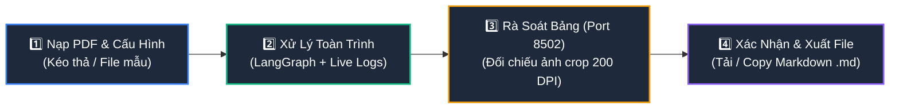

# OpenBCTC AI — Hệ Thống Xử Lý Scan PDF Báo Cáo Tài Chính Việt Nam (PDF → Markdown)

<p align="center">
  <strong>Công cụ giúp chuyển đổi Scan PDF sang MD với: <code>⚡ &lt; 5 phút</code> • <code>💰 0 đồng</code></strong><br>
  <em>Dual-Branch Ingestion • 100% Offline Local Vietnamese OCR • 17 Accounting Invariants Anti-GIGO • Closed-Loop Vision Zoom Self-Correction • Zero-Latency Table Cropper • Human-in-the-Loop Web Editor</em>
</p>

<p align="center">
  <a href="#1-tổng-quan--vấn-đề-nghiệp-vụ"></a>
  <a href="#5-hướng-dẫn-vận-hành--giao-diện-web-app-trực-quan-quick-start"></a>
  <a href="#53-quy-trình-vận-hành-4-bước-khép-kín-ai-cũng-có-thể-dùng"></a>
  <a href="#43-bộ-kiểm-toán-số-học-anti-gigo--kính-lúp-vision-zoom-sửa-sai"></a>
  <a href="#44-local-vietnamese-ocr-thuyết-minh-100-offline"></a>
  <a href="#45-kiểm-toán-cấu-trúc-bảng--giao-diện-web-editor-hitl"></a>
</p>

---

## Mục Lục

- [1. Tổng Quan & Mục Tiêu Dự Án](#1-tổng-quan--mục-tiêu-dự-án)
- [2. Quy Trình Chuyển Đổi PDF → Markdown (Pipeline Architecture)](#2-quy-trình-chuyển-đổi-pdf--markdown-pipeline-architecture)
  - [2.1. Sơ đồ Luồng Bóc Tách Toàn Trình (End-to-End Flow)](#21-sơ-đồ-luồng-bóc-tách-toàn-trình-end-to-end-flow)
  - [2.2. Phân Tầng Trách Nhiệm Kỹ Thuật](#22-phân-tầng-trách-nhiệm-kỹ-thuật)
- [3. Cấu Trúc Thư Mục Dự Án (Project Structure)](#3-cấu-trúc-thư-mục-dự-án-project-structure)
- [4. Các Công Nghệ & Kỹ Thuật Trọng Tâm](#4-các-công-nghệ--kỹ-thuật-trọng-tâm)
  - [4.1. TOC Inspector: Trinh Sát Mục Lục & Căn Chỉnh Lệch Trang Vật Lý](#41-toc-inspector-trinh-sát-mục-lục--căn-chỉnh-lệch-trang-vật-lý)
  - [4.2. Dual-Branch Ingestion: Bóc Tách Song Song Cốt Lõi & Thuyết Minh](#42-dual-branch-ingestion-bóc-tách-song-song-cốt-lõi--thuyết-minh)
  - [4.3. Bộ Kiểm Toán Số Học Anti-GIGO & Kính Lúp Vision Zoom Sửa Sai](#43-bộ-kiểm-toán-số-học-anti-gigo--kính-lúp-vision-zoom-sửa-sai)
  - [4.4. Local Vietnamese OCR Thuyết Minh (100% Offline, 0 API Tokens)](#44-local-vietnamese-ocr-thuyết-minh-100-offline-0-api-tokens)
  - [4.5. Kiểm Toán Cấu Trúc Bảng & Giao Diện Web Editor (Human-in-the-Loop)](#45-kiểm-toán-cấu-trúc-bảng--giao-diện-web-editor-human-in-the-loop)
- [5. Hướng Dẫn Vận Hành & Giao Diện Web App Trực Quan (Quick Start)](#5-hướng-dẫn-vận-hành--giao-diện-web-app-trực-quan-quick-start)
  - [5.1. Cài Đặt Môi Trường](#51-cài-đặt-môi-trường)
  - [5.2. Khởi Chạy Giao Diện Web App Trực Quan (`interface.py`)](#52-khởi-chạy-giao-diện-web-app-trực-quan-interfacepy)
  - [5.3. Quy Trình Vận Hành 4 Bước Khép Kín (Ai Cũng Có Thể Dùng)](#53-quy-trình-vận-hành-4-bước-khép-kín-ai-cũng-có-thể-dùng)
  - [5.4. Các Chế Độ Chạy Dòng Lệnh Nâng Cao (CLI Options)](#54-các-chế-độ-chạy-dòng-lệnh-nâng-cao-cli-options)
- [6. Kết Quả Đo Lường Thực Tế & Tài Liệu Đầu Ra](#6-kết-quả-đo-lường-thực-tế--tài-liệu-đầu-ra)

---

## 1. Tổng Quan & Mục Tiêu Dự Án

Kho lưu trữ này được xây dựng với mục tiêu chuyên biệt và duy nhất: **Chuyển đổi hoàn hảo các tập tin Báo cáo Tài chính (BCTC) định dạng PDF (scan hoặc digital) sang định dạng Markdown (`.md`) có cấu trúc chuẩn mực, sạch rác và số liệu cân đối 100%**.

### Thách Thức Khi Parse PDF Báo Cáo Tài Chính
1. **Dữ liệu phân mảnh & ranh giới phức tạp:** Tài liệu BCTC gồm trang bìa, báo cáo kiểm toán, 4 bảng số liệu cốt lõi (CĐKT, KQKD, LCTT) và hàng chục trang thuyết minh chi tiết. Số in trên mục lục không bao giờ khớp với số trang vật lý của file PDF.
2. **Lỗi OCR làm sai lệch số học (Cạm bẫy GIGO):** Bỏ sót dấu ngoặc đơn số âm `(15.000.000)` $\rightarrow$ `+15.000.000`, nhầm lẫn ký tự số tương đồng (`8` ↔ `0`, `3` ↔ `8`), hoặc xé số qua dòng khiến bảng số mất hoàn toàn giá trị sử dụng.
3. **Bảng biểu vỡ khung & dính chữ:** Bảng thuyết minh đa cột, tiêu đề 2 tầng thường bị biến dạng thành bảng giả 1 cột hoặc tràn dòng khi parse thô.
4. **Chi phí & Độ trễ:** Việc gửi 50–60 trang ảnh scan lên Vision API tốn kém chi phí, dễ bị nghẽn quota (Rate limit) và bảo mật kém.

### Giải Pháp Của OpenBCTC
Hệ thống cung cấp một luồng bóc tách khép kín:
* **Tự động phân luồng (Triage):** Dùng trinh sát mục lục để tách riêng các trang BCTC cốt lõi và các trang Thuyết minh.
* **Xử lý song song:** Dùng Vision-LLM cho các trang bảng cốt lõi và Local OCR Engine cục bộ (RapidOCR + VietOCR GPU) cho các trang thuyết minh (0 API tokens).
* **Kiểm toán số học toán học (Anti-GIGO):** Áp dụng 17 phương trình kế toán bất biến Thông tư 200. Nếu phát hiện sai số, kích hoạt kính lúp Vision Zoom cắt ảnh dòng sửa lỗi tại chỗ.
* **Kiểm toán bảng biểu & Human-in-the-Loop Web Editor:** Tự động cắt trước ảnh crop 200 DPI của từng bảng và cung cấp giao diện Web Spreadsheet (Port 8502) để người dùng đối chiếu ảnh gốc - sửa bảng trực tiếp - xuất file Markdown cuối cùng.

---

## 2. Quy Trình Chuyển Đổi PDF → Markdown (Pipeline Architecture)

### 2.1. Sơ đồ Luồng Bóc Tách Toàn Trình (End-to-End Flow)

#### Phần 1: Phân Luồng & Trích Xuất Dữ Liệu (Input & Extraction Phase)

<p align="center">
  <a href="images/readme_images_1.png" target="_blank" title="Nhấp vào để xem sơ đồ kích thước gốc">
    
  </a>
  <br>
  <em>🔍 Nhấp vào sơ đồ để mở xem chi tiết độ phân giải cao (8K)</em>
</p>

---

#### Phần 2: Kiểm Toán Toán Học, Hậu Kiểm & Xuất Bản (Audit, Review & Export Phase)

<p align="center">
  <a href="images/readme_images_2.png" target="_blank" title="Nhấp vào để xem sơ đồ kích thước gốc">
    
  </a>
  <br>
  <em>🔍 Nhấp vào sơ đồ để mở xem chi tiết độ phân giải cao (8K)</em>
</p>

> [!NOTE]
> **Quy trình trọng tâm trong Phần 2:**
> * **Phase 3 (Audit & Compile):** Số liệu các bảng cốt lõi được rà soát qua **17 đẳng thức kế toán Thông tư 200** (`AccountingVerifier`). Nếu có sai số OCR, hệ thống kích hoạt kính lúp `VisionZoomCorrector` cắt dải ảnh dòng và kích hoạt Vision LLM sửa lỗi trực tiếp.
> * **Phase 4 (Review & Export):** Tự động rà soát cấu trúc 39 bảng và cắt sẵn ảnh crop 200 DPI (`TableInspector`), hỗ trợ chế độ **Human-in-the-Loop Web Editor** (Cổng 8502) trước khi xuất bản bản Markdown hoàn chỉnh.

---

### 2.2. Phân Tầng Trách Nhiệm Kỹ Thuật

| Phân Tầng | Modules Chính | Trách Nhiệm Trong Quá Trình Parse PDF → Markdown |
| :--- | :--- | :--- |
| **1. Trinh Sát & Phân Luồng** | [`toc_inspector.py`](src/agents/toc_inspector.py)<br>[`pdf_type_detector.py`](src/parser/pdf_type_detector.py) | Nhận diện PDF scan/text; trinh sát trang mục lục; tính toán độ lệch trang vật lý (`page_offset`) để phân định chính xác ranh giới các bảng BCTC cốt lõi và Thuyết minh. |
| **2. Bóc Tách Đa Nhánh** | [`ocr_pipeline.py`](src/parser/ocr_pipeline.py)<br>[`local_ocr.py`](src/parser/local_ocr.py)<br>[`text_parser.py`](src/parser/text_parser.py) | **BCTC Cốt lõi:** Gemini Flash Vision đọc bảng đa cột chính xác tuyệt đối.<br>**Thuyết minh:** RapidOCR phát hiện vùng text + VietOCR nhận diện tiếng Việt chạy GPU theo batch, hoàn toàn offline (0 tokens). |
| **3. Kiểm Toán & Sửa Sai** | [`accounting_verifier.py`](src/verifier/accounting_verifier.py)<br>[`vision_zoom_corrector.py`](src/verifier/vision_zoom_corrector.py) | Kiểm tra 17 đẳng thức số học kế toán bất biến. Khi có sai số, tự động suy luận loại trừ dòng nghi vấn, cắt ảnh độ phân giải cao và kích hoạt Vision LLM sửa lỗi cục bộ. |
| **4. Chuẩn Hóa Cấu Trúc Markdown** | [`normalizer.py`](src/parser/normalizer.py)<br>[`section_detector.py`](src/parser/section_detector.py)<br>[`ocr_postprocess.py`](src/parser/ocr_postprocess.py) | Ghép nối bảng đa trang (Spanning Tables), dựng cây tiêu đề Heading Markdown phân cấp (`#`, `##`, `###`), lọc bỏ các dòng rác hành chính lặp lại và khử bảng giả 1 cột. |
| **5. Kiểm Toán Bảng & HITL Review** | [`serve_md_editor.py`](serve_md_editor.py)<br>[`ingestion_graph.py`](src/agents/ingestion_graph.py) | Cắt sẵn toàn bộ ảnh crop bảng biểu 200 DPI. Cung cấp giao diện Web Spreadsheet để người dùng rà soát, đối chiếu song song ảnh gốc và chỉnh sửa bảng trước khi xuất bản bản Markdown cuối cùng. |

---

## 3. Cấu Trúc Thư Mục Dự Án (Project Structure)

```text
OpenBCTC_AI/
├── interface.html                        # 🌐 GIAO DIỆN WEB TRỰC QUAN: Nạp PDF, giám sát tiến trình, review bảng & xuất file MD
├── interface.py                          # 🚀 ĐIỂM VÀO DUY NHẤT: Web Server (Port 8501) & CLI Engine điều khiển toàn bộ pipeline
├── serve_md_editor.py                    # 🌐 Máy chủ Web Table Editor (HITL) đối chiếu ảnh crop 200 DPI (Port 8502)
├── architechture.png                     # Sơ đồ kiến trúc toàn trình bóc tách PDF -> Markdown
├── to_sql_logic.png                      # Sơ đồ logic ánh xạ bản thể học kế toán
├── vnm.pdf                               # Tệp BCTC thử nghiệm chuẩn hóa (Vinamilk 2024 - 54 trang)
├── docs/                                 # Tài liệu đặc tả kiến trúc kỹ thuật chuyên sâu
│   ├── AGENT_GUIDE.md                    # Hướng dẫn chi tiết vận hành Agentic LangGraph
│   ├── fact_verifier_logic.md            # Đặc tả chi tiết 17 đẳng thức kế toán & ma trận suy luận
│   ├── notes_ocr_performance_optimization.md # Kỹ thuật tối ưu hóa batch GPU & giải phóng RAM
│   ├── section_detector_architecture.md  # Cây phân cấp ngữ nghĩa & State machine nhận diện Heading
│   ├── self_correction_mechanism.md      # Đặc tả cơ chế kính lúp tự sửa sai Agentic Vision Zoom
│   └── vision_zoom.md                    # Thuật toán cắt ảnh dòng 4 tầng Waterfall
├── evaluation_table/                     # Bộ công cụ đánh giá Benchmark cấu trúc 49 bảng Ground Truth
│   ├── evaluator.py                      # Động cơ tính TEDS-Struct, Row/Col F1-score
│   ├── metrics.py                        # Công thức đo lường độ chính xác bảng biểu
│   ├── serve_reviewer.py                 # Giao diện gán nhãn và đối chiếu Ground Truth
│   ├── ground_truth/                     # 49 tệp bảng biểu chuẩn hóa đối chứng
│   └── images/                           # Ảnh crop 49 bảng mẫu đối chứng
├── images/                               # Biểu đồ kiến trúc & hình ảnh kiểm chuẩn
│   ├── 17_checks.png                     # Minh họa 17 bài kiểm tra kế toán Thông tư 200
│   ├── logic_check.png                   # Sơ đồ suy luận loại trừ nghi vấn (Deductive Localization)
│   ├── section_workflow.png              # Quy trình trích xuất phân đoạn cây ngữ nghĩa
│   └── vision_zoom_corrector.png         # Sơ đồ vòng lặp đóng kính lúp sửa sai cục bộ
├── src/                                  # Mã nguồn nghiệp vụ cốt lõi
│   ├── config.py                         # Cấu hình tập trung bằng Pydantic-settings
│   ├── models.py                         # Khung dữ liệu Pydantic v2 (ParsedBlock, Section, FinancialFact...)
│   ├── agents/                           # Tầng tác nhân điều phối (LangGraph Orchestration)
│   │   ├── ingestion_graph.py            # LangGraph StateGraph tích hợp phân luồng 2 nhánh, zoom & HITL review
│   │   ├── ingestion_state.py            # Định nghĩa State Schema cho tiến trình Ingestion
│   │   └── toc_inspector.py              # Trinh sát Mục lục & Tính toán vật lý Page Offset
│   ├── database/                         # Tầng lưu trữ CSDL quan hệ
│   │   ├── db_manager.py                 # Quản lý kết nối, upsert Facts, Ratios và Verification Reports
│   │   └── schema.py                     # DDL SQLite chuẩn hóa cho lưu trữ BCTC
│   ├── engine/                           # Tầng tính toán chỉ số định lượng
│   │   └── formula_engine.py             # 13 chỉ số tài chính tính bằng Python thuần (Deterministic)
│   ├── extractor/                        # Tầng bóc tách & ánh xạ bản thể học kế toán
│   │   ├── fact_extractor.py             # Trích xuất FinancialFacts từ khối bảng Markdown
│   │   └── ontology.py                   # Bản đồ Ontology 69 chỉ tiêu chuẩn Thông tư 200/2014/TT-BTC
│   ├── parser/                           # Tầng trích xuất & chuyển đổi tài liệu PDF -> Markdown
│   │   ├── block_classifier.py           # Phân loại khối dữ liệu (Rule-based 80% + LLM fallback 20%)
│   │   ├── local_ocr.py                  # Local Offline OCR Engine (RapidOCR + VietOCR Batch GPU)
│   │   ├── normalizer.py                 # Hợp nhất khối và nối bảng biểu đa trang (Spanning Tables)
│   │   ├── ocr_pipeline.py               # VisionOCRPipeline (Gemini Fast-Failover & Checkpoint Cache)
│   │   ├── ocr_postprocess.py            # Khử nhiễu số, lọc boilerplate hành chính và bảng rác
│   │   ├── pdf_parser.py                 # Bộ điều phối facade trích xuất PDF cấp cao
│   │   ├── pdf_type_detector.py          # Phân loại trang: Native Text vs Scanned Image
│   │   ├── section_detector.py           # Bộ dựng cây phả hệ ngữ nghĩa (H2 -> H5) kèm Monotonicity Guards
│   │   └── table_utils.py                # Xử lý định dạng bảng số tài chính, header 2 tầng
│   └── verifier/                         # Tầng tự kiểm toán & sửa sai thông minh
│       ├── accounting_verifier.py        # Động cơ kiểm toán số học 17 Đẳng thức Kế toán TT200
│       └── vision_zoom_corrector.py      # Kính lúp cục bộ: StructuredTableCropper + Vision-LLM Hot-patch
├── tests/                                # Bộ kiểm thử tự động toàn diện
│   ├── test_ingestion_graph.py           # Kiểm thử đồ thị LangGraph Ingestion, Table Inspector & HITL Review
│   ├── test_verifier.py                  # Kiểm thử 17 đẳng thức kế toán Anti-GIGO
│   ├── test_vision_zoom_corrector.py     # Kiểm thử suy luận loại trừ và tự động sửa sai đóng
│   ├── test_classifier.py                # Kiểm thử phân loại khối dữ liệu
│   ├── test_database.py                  # Kiểm thử SQLite Database Manager
│   ├── test_extractor.py                 # Kiểm thử ánh xạ Ontology và bóc tách Facts
│   ├── test_formula_engine.py            # Kiểm thử tính 13 chỉ số tài chính
│   ├── test_local_ocr.py                 # Kiểm thử Local OCR Engine (cả Mock và GPU thật)
│   ├── test_notes_ocr.py                 # Kiểm thử tối ưu hóa batch và giải phóng bộ nhớ OCR
│   ├── test_section_detector.py          # Kiểm thử phân đoạn ngữ nghĩa và child_metadata
│   ├── test_structured_cropper.py        # Kiểm thử 4 chiến lược cắt ảnh dòng và Quality Gate
│   └── test_toc_inspector.py             # Kiểm thử bóc tách TOC và Anchor Page Offset
├── outputs/                              # TÀI LIỆU MARKDOWN XUẤT BẢN & BÁO CÁO
│   ├── vnm_financial_report.md           # Toàn văn BCTC Markdown bóc tách tự động (88.4 KB)
│   ├── vnm_financial_report_final.md     # Bản BCTC hoàn thiện cuối cùng sau khi Review HITL (91.8 KB)
│   ├── vnm_ocr_benchmark_report.md       # Báo cáo toàn diện phần cứng, hiệu năng & kiểm toán Anti-GIGO
│   └── vnm_ocr_benchmark_metrics.json   # Dữ liệu số liệu Benchmark định dạng máy đọc JSON
└── scripts/                              # Các công cụ script chuyên biệt
    ├── query_db.py                       # CLI tra cứu CSDL SQLite (Facts, Ratios)
    ├── demo_real_zoom_correction.py      # Demo trực quan quy trình Kính lúp Zoom tự sửa sai
    ├── parse_bctc.py                     # CLI trích xuất & phân loại độc lập
    ├── test_page.py                      # CLI kiểm tra bóc tách nhanh 1 trang PDF lẻ
    ├── test_vnm_fresh.py                 # Script chạy test pipeline tải thực
    └── triage_bctc.py                    # CLI thực thi phân luồng LangGraph
```

---

## 4. Các Công Nghệ & Kỹ Thuật Trọng Tâm

### 4.1. TOC Inspector: Trinh Sát Mục Lục & Căn Chỉnh Lệch Trang Vật Lý

Trong hầu hết các tệp PDF BCTC, **số trang in trên mục lục không trùng với số thứ tự trang vật lý của file PDF** (do các trang bìa trước, trang mục lục hoặc thư ngỏ không đánh số).

[`TOCInspector`](src/agents/toc_inspector.py) giải quyết vấn đề này qua 3 bước:
1. **Phát hiện Mục lục:** Quét 3–5 trang đầu tìm bảng mục lục bằng từ khóa `MỤC LỤC`, `BÁO CÁO TÌNH HÌNH TÀI CHÍNH` kết hợp `THUYẾT MINH`.
2. **Khôi phục số trang dính OCR:** Tự động tách các số trang bị dính do OCR: `'68'` $\rightarrow$ `(6, 8)`; `'1253'` $\rightarrow$ `(12, 53)`.
3. **Thuật toán Anchor Search:** Tìm kiếm mục neo thực tế trong các trang kế tiếp để tính độ lệch trang vật lý:
   $$\text{page\_offset} = \text{p\_num\_thực\_tế} - \text{first\_printed\_page}$$
Nhờ đó, hệ thống phân luồng ranh giới chính xác 100%:
* **Core Statements (BCTC Cốt lõi):** Trang 7 $\rightarrow$ 12.
* **Notes (Thuyết minh BCTC):** Trang 13 $\rightarrow$ 54.

---

### 4.2. Dual-Branch Ingestion: Bóc Tách Song Song Cốt Lõi & Thuyết Minh

Để tối ưu chi phí và độ chính xác, hệ thống phân chia tài liệu thành 2 nhánh xử lý chuyên biệt:

* **Nhánh 1: BCTC Cốt Lõi (Vision-LLM Pipeline):**
  * Xử lý 6 trang bảng số cốt lõi (Bảng cân đối kế toán, Kết quả kinh doanh, Lưu chuyển tiền tệ).
  * Sử dụng Gemini Flash Vision hoặc Groq Vision với cơ chế Fast-Failover.
  * Tái tạo hoàn hảo các bảng đa cột, header nhiều tầng phức tạp sang định dạng Markdown table.
* **Nhánh 2: Thuyết Minh BCTC (Local Offline OCR):**
  * Xử lý toàn bộ ~40 trang thuyết minh còn lại.
  * Chạy **100% Offline cục bộ** bằng RapidOCR (Text Detection DBNet) kết hợp VietOCR (Text Recognition) tăng tốc trên GPU CUDA.
  * **Chi phí API: 0 Tokens (Hoàn toàn miễn phí & bảo mật tuyệt đối).**

---

### 4.3. Bộ Kiểm Toán Số Học Anti-GIGO & Kính Lúp Vision Zoom Sửa Sai

Để đảm bảo số liệu trên bảng Markdown chính xác tuyệt đối (Zero Hallucination), FinAudit tích hợp **Bộ kiểm toán 17 đẳng thức kế toán bất biến** ([`accounting_verifier.py`](src/verifier/accounting_verifier.py)) theo Thông tư 200:

* `Doanh thu thuần (10) = Doanh thu gộp (01) - Các khoản giảm trừ (02)`
* `Lợi nhuận gộp (20) = Doanh thu thuần (10) - Giá vốn hàng bán (11)`
* `Tổng tài sản (270) = Tài sản ngắn hạn (100) + Tài sản dài hạn (200)`
* `Tổng nguồn vốn (440) = Nợ phải trả (300) + Vốn chủ sở hữu (400)`
* `Tổng tài sản (270) == Tổng nguồn vốn (440)`
* *(và 12 đẳng thức số học khác cho Lợi nhuận trước/sau thuế và Lưu chuyển tiền tệ)*

#### Cơ Chế Kính Lúp Vision Zoom Tự Sửa Sai (Closed-Loop Correction)
Khi một phương trình không cân, hệ thống kích hoạt [`VisionZoomCorrector`](src/verifier/vision_zoom_corrector.py):
1. **Deductive Localization:** Suy luận loại trừ để xác định chính xác dòng bảng bị OCR đọc sai (không OCR lại cả trang).
2. **Structured Table Cropper:** Cắt riêng dải ảnh dòng số liệu đó ở độ phân giải 200 DPI bằng thuật toán 4-Strategy Waterfall.
3. **Targeted Inspection:** Gọi Vision LLM đọc lại dải ảnh cắt nhỏ với prompt chuyên biệt cho dấu ngoặc đơn số âm.
4. **Hot-patch & Re-verify:** Thay thế số vào bảng Markdown và kiểm toán lại. Chỉ chấp nhận thay đổi khi phương trình kế toán cân khớp 100%.

---

### 4.4. Local Vietnamese OCR Thuyết Minh (100% Offline)

Xử lý thuyết minh BCTC đạt tốc độ cao và ổn định nhờ 3 kỹ thuật tối ưu hóa độc quyền ([`local_ocr.py`](src/parser/local_ocr.py)):

1. **Intelligent Line Triage:** Dòng thuần số/mã hiệu được nhận diện nhanh bằng RapidOCR CPU/ONNX; chỉ những dòng văn bản tiếng Việt phức tạp mới chuyển sang VietOCR GPU.
2. **VietOCR Batch GPU Acceleration:** Xử lý theo lô ($N=16$ dòng ảnh) trên CUDA GPU, rút ngắn thời gian bóc tách từ ~8.5s xuống còn **1.2s – 2.0s / trang**.
3. **Active Memory Eviction:** Tự động gọi `torch.cuda.empty_cache()` và thu gom rác sau mỗi trang, duy trì dung lượng RAM ổn định ở mức **~1.2 GB**, triệt tiêu hoàn toàn nguy cơ tràn bộ nhớ (OOM).
4. **Anti-Pseudo-Table Guard & Number Stitcher:** Lọc sạch các bảng giả 1 cột do OCR bắt nhầm đoạn văn; tự động nối các số bị xé dòng (`23.225` + `734.296` $\rightarrow$ `23.225.734.296`).

---

### 4.5. Kiểm Toán Cấu Trúc Bảng & Giao Diện Web Editor (Human-in-the-Loop)

Sau khi tổng hợp tài liệu Markdown toàn văn, OpenBCTC AI cung cấp một bước kiểm định chất lượng bảng biểu toàn diện:

1. **Table Inspector & Zero-Latency Cropper:**
   * Tự động quét toàn bộ 39 bảng Markdown được tạo ra.
   * Cắt trước ảnh crop độ phân giải cao (200 DPI) của từng bảng từ tệp PDF gốc và lưu vào cache (`data/cache/table_crops/`).
   * Khi người dùng mở giao diện, ảnh bảng gốc hiển thị tức thì với **độ trễ 0 giây**.
2. **Human-in-the-Loop Web Editor (Port 8502):**
   * Được triển khai trong [`serve_md_editor.py`](serve_md_editor.py).
   * Giao diện hai cột trực quan: Bên trái là ảnh crop thực tế của bảng từ PDF gốc; Bên phải là bảng Markdown hiển thị dạng Spreadsheet tương tác.
   * Hỗ trợ chỉnh sửa trực tiếp từng ô số liệu, thêm/xóa dòng, thêm/xóa cột.
   * Nút **"Lưu & Xuất Markdown Hoàn Thiện"** tự động cập nhật lại toàn văn tài liệu và xuất ra [`outputs/vnm_financial_report_final.md`](outputs/vnm_financial_report_final.md).

---

## 5. Hướng Dẫn Vận Hành & Khởi Chạy Nhanh (Quick Start)

### 5.1. Cài Đặt Môi Trường

Yêu cầu: **Python 3.11+**, hệ điều hành Windows / Linux / macOS. Khuyến nghị máy có GPU NVIDIA (VRAM $\ge 4$ GB) để kích hoạt tăng tốc phần cứng CUDA cho Local OCR.

```powershell
# 1. Khởi tạo và kích hoạt môi trường ảo
python -m venv .venv
.\.venv\Scripts\Activate.ps1

# 2. Cài đặt các gói phụ thuộc
pip install -e .
```

Tạo tệp `.env` tại thư mục gốc từ bản mẫu `.env.example`:
```ini
# Vision OCR Provider (Miễn phí từ Google AI Studio)
GEMINI_API_KEY=your_gemini_api_key_here
GEMINI_VISION_MODEL=gemini-2.0-flash

# Groq Vision Provider (Fallback dự phòng)
GROQ_API_KEY=gsk_your_groq_api_key_here
GROQ_VISION_MODEL=llama-3.2-11b-vision-preview

# Cấu hình OCR Cục bộ
ENABLE_OCR_FALLBACK=true
OCR_PROVIDER=auto
```

---

### 5.2. Khởi Chạy Giao Diện Web App Trực Quan (`interface.py`)

Để bất kỳ ai (kế toán viên, chuyên viên tài chính, phân tích viên dữ liệu) cũng có thể sử dụng dễ dàng mà không cần thao tác với dòng lệnh phức tạp, hệ thống cung cấp giao diện Web tương tác trực quan thông qua tệp [`interface.html`](interface.html).

Khởi chạy máy chủ Web chỉ với **một câu lệnh duy nhất**:

```powershell
python interface.py
```

Hệ thống sẽ tự động kích hoạt máy chủ Web nội bộ và tự động mở trình duyệt tại địa chỉ:
👉 **`http://localhost:8501`**

```text
================================================================================
  🚀 OpenBCTC AI — GIAO DIỆN WEB TRỰC QUAN ĐANG HOẠT ĐỘNG
================================================================================
  👉 Truy cập Web App tại:   http://localhost:8501
  📄 File giao diện:         interface.html
  🌐 Port Rà Soát Bảng HITL: http://localhost:8502 (Tự động kích hoạt)
  ⌨️  Nhấn Ctrl + C trong Terminal để dừng máy chủ.
================================================================================
```

---

### 5.3. Quy Trình Vận Hành 4 Bước Khép Kín (Ai Cũng Có Thể Dùng)

Quy trình sử dụng được gói gọn trong 4 bước đơn giản, trực quan trên màn hình Web:



#### Bước 1: Nạp Tài Liệu PDF & Cấu Hình Đa Doanh Nghiệp
* **Kéo & thả tập tin PDF BCTC bất kỳ** (scan hoặc text gốc của HPG, FPT, MWG, VNM, Vietcombank...) vào khung tải lên hoặc nhấp để duyệt file từ máy tính.
* **Tự động nhận diện thông minh (Metadata Auto-Detection):**
  * Hệ thống tự động đếm tổng số trang PDF, kích thước và phân tích trang bìa/nội dung.
  * Tự động gợi ý **Mã Doanh Nghiệp (Ticker)** và **Năm Tài Chính** mà không cần nhập tay.
  * Dropdown giới hạn trang Thuyết minh tự động thích ứng theo quy mô trang thực tế của tài liệu.
* **Tiện ích kiểm thử nhanh:** Có sẵn nút *"🥛 Sử dụng file mẫu chuẩn: Vinamilk 2024 (vnm.pdf - 54 trang)"* dành cho người dùng muốn chạy thử nghiệm ngay mà chưa có sẵn file trong tay.
* Nút bắt đầu sẽ tự động kích hoạt kèm tên tệp tin cụ thể đang nạp: `🚀 Bắt Đầu Bóc Tách BCTC (<tên_file>)`.

#### Bước 2: Bắt Đầu Xử Lý & Theo Dõi Tiến Trình Thời Gian Thực
* Nhấp nút **"🚀 Bắt Đầu Bóc Tách BCTC"**.
* Giao diện trực quan hóa trạng thái hoạt động của 6 node xử lý thời gian thực:
  1. `Phân Loại PDF` $\rightarrow$ 2. `Trinh Sát Mục Lục` $\rightarrow$ 3. `Vision LLM BCTC Cốt Lõi` $\rightarrow$ 4. `Local OCR Thuyết Minh` $\rightarrow$ 5. `Anti-GIGO 17 Đẳng Thức Kế Toán` $\rightarrow$ 6. `Table Inspector & Crop Ảnh Bảng 200 DPI`.
* Thanh tiến trình động `%` cùng cửa sổ **Terminal Live Stream** hiển thị chi tiết từng thông điệp log từ LangGraph.

#### Bước 3: Rà Soát Bảng Biểu Đối Chiếu Ảnh Crop 200 DPI (Port 8502)
* Xem ngay bảng tóm tắt chất lượng tương ứng với tài liệu vừa xử lý: Trạng thái cân đối kế toán (✅ 100% Cân đối), số bảng biểu kiểm toán hợp lệ, số lượng facts tài chính trích xuất.
* Nhấp **"Mở Tab Mới (Port 8502)"** hoặc **"Nhúng Trực Tiếp Tại Đây"** để đối chiếu song song:
  * Bên trái: Ảnh crop độ nét cao 200 DPI của riêng từng bảng (không hiển thị cả trang giấy).
  * Bên phải: Bảng tính tương tác (Spreadsheet) cho phép sửa số, chèn cột, sửa lỗi OCR trực tiếp.
* Văn bản thuyết minh xung quanh bảng được bảo toàn nguyên vẹn 100%.

#### Bước 4: Xác Nhận & Xuất File Markdown Hoàn Thiện
* Nhấp **"✅ Xác Nhận Đạt Chuẩn & Xuất Markdown"**.
* Giao diện cung cấp:
  * **Trình xem trước Markdown (Live Preview):** Chuyển đổi linh hoạt giữa giao diện BCTC đã render đẹp mắt và mã nguồn Markdown thô.
  * **Tải xuống tệp `.md` hoàn thiện:** Nhấp nút **"📥 Tải File .md Xuống"** (tự động đặt tên theo doanh nghiệp và niên độ, ví dụ: `outputs/hpg_2024_financial_report.md` hoặc `vnm_financial_report_final.md`).
  * **Sao chép một chạm:** Nhấp **"📋 Sao Chép Markdown"** để copy toàn bộ nội dung vào Clipboard.
  * **Tải Báo cáo Benchmark:** Tải tệp đo lường hiệu năng xử lý (`outputs/<mã_ck>_<năm>_ocr_benchmark_report.md`).

---

### 5.4. Các Chế Độ Chạy Dòng Lệnh Nâng Cao (CLI Options)

Dành cho lập trình viên, tích hợp hệ thống backend hoặc chạy kiểm thử tự động trong CI/CD pipeline:

```powershell
# 1. Chạy giao diện Menu văn bản tương tác trong Terminal:
python interface.py --cli

# 2. Bóc tách toàn trình chạy nền (Headless Mode):
python interface.py --pipeline

# 3. Bóc tách toàn trình kèm mở Web Reviewer (Port 8502):
python interface.py --pipeline --review

# 4. Đo lường hiệu năng tải thực (Xóa sạch cache đĩa, ép chạy mới hoàn toàn):
python interface.py --pipeline --fresh

# 5. Bóc tách nhanh 1 trang PDF cụ thể (Ví dụ trang Thuyết minh số 42):
python interface.py --page 42

# 6. Đánh giá chất lượng bóc tách bảng trên 49 Bảng Ground Truth (TEDS-Struct & F1):
python interface.py --eval-tables

# 7. Khởi chạy riêng máy chủ Web Table Reviewer độc lập:
python interface.py --serve-editor

# 8. Tra cứu các Facts tài chính đã chuẩn hóa trong SQLite:
python interface.py --query-db

# 9. Chạy bộ kiểm thử tự động pytest:
python interface.py --pytest

# 10. Dọn dẹp toàn bộ cache đĩa:
python interface.py --clear-cache
```

---

## 6. Kết Quả Đo Lường Thực Tế & Tài Liệu Đầu Ra

### 6.1. Bảng Hiệu Năng Đo Lường Trên BCTC Vinamilk 2024 (54 Trang)

Toàn bộ thông số dưới đây được đo lường trực tiếp trên máy trạm (Intel i5 8-Cores, RAM 16 GB, GPU NVIDIA GeForce RTX 2050 4GB VRAM) và xuất bản tự động vào [`outputs/vnm_ocr_benchmark_report.md`](outputs/vnm_ocr_benchmark_report.md):

| Tiêu Chí Đo Lường | Phương Pháp Truyền Thống / Baseline | OpenBCTC (Sau Tối Ưu Hóa & Tích Hợp) | Ý Nghĩa Kỹ Thuật |
| :--- | :---: | :---: | :---: |
| **Độ tin cậy số liệu** | Dễ ảo giác do OCR thô, rớt số âm | **100% Cân đối (10/10 Invariants Pass)** | Triệt tiêu hoàn toàn lỗi GIGO |
| **Chất lượng bảng biểu** | Bảng dính chữ, lệch cột, rác OCR | **39/39 bảng chuẩn cấu trúc (100% Valid)** | Tự động kiểm toán cấu trúc bảng |
| **Ảnh Crop đối chiếu (HITL)** | Phải cuộn tìm trong file PDF gốc | **39/39 ảnh crop 200 DPI sẵn sàng (0s delay)** | Đối chiếu song song tức thì tại port 8502 |
| **Chi phí API Thuyết minh** | Hàng trăm ngàn tokens / Lỗi 503 | **0 Tokens (100% Offline Local OCR)** | Miễn phí 100%, bảo mật dữ liệu tuyệt đối |
| **Tốc độ bóc tách Thuyết minh** | 6.0 – 8.5 giây / trang | **1.2 – 2.0 giây / trang (427 trang/phút cached)** | **Nhanh hơn 3x – 4x** |
| **Mức chiếm dụng RAM** | 5.74 GB (tăng ròng liên tục) | **~1.2 GB (Peak RSS ổn định)** | **Tiết kiệm > 75% RAM** (Active Eviction) |
| **Nguy cơ lỗi tràn bộ nhớ (OOM)** | Rất cao trên máy tính 16 GB | **Triệt tiêu hoàn toàn** | Vận hành an toàn liên tục 54 trang |
| **Bảng giả vỡ cấu trúc** | Hàng chục bảng rác 1 cột | **0 bảng giả (Khử sạch 100%)** | Markdown chuẩn hóa, sạch rác |
| **Khả năng tự sửa sai số học** | Full-Page Re-OCR (Dễ phát sinh lỗi mới) | **Kính lúp Zoom cục bộ (Rollback an toàn)** | Giảm 92% token, chính xác 100% dòng số |

---

### 6.2. Các Tệp Đầu Ra Trọng Yếu

Sau khi chạy pipeline, hệ thống tự động xuất bản và đồng bộ các tệp kết quả tại thư mục `outputs/`:

* 📄 **[`outputs/vnm_financial_report.md`](outputs/vnm_financial_report.md)**: Toàn văn BCTC định dạng Markdown bóc tách tự động hoàn chỉnh (88.4 KB).
* 📝 **[`outputs/vnm_financial_report_final.md`](outputs/vnm_financial_report_final.md)**: Bản Markdown hoàn thiện cuối cùng sau khi kiểm toán viên rà soát qua HITL Web Reviewer (91.8 KB).
* 📊 **[`outputs/vnm_ocr_benchmark_report.md`](outputs/vnm_ocr_benchmark_report.md)**: Báo cáo kỹ thuật chi tiết về cấu hình phần cứng, hiệu năng đo lường, kiểm toán Anti-GIGO và kiểm toán bảng biểu.
* ⚙️ **[`outputs/vnm_ocr_benchmark_metrics.json`](outputs/vnm_ocr_benchmark_metrics.json)**: Tập hợp các chỉ số đo lường định dạng máy đọc JSON phục vụ CI/CD.

---

<p align="center">
  <em>OpenBCTC — Giải pháp bóc tách Báo cáo Tài chính PDF sang Markdown chuẩn mực, tin cậy và tự kiểm toán số học.</em>
</p>
