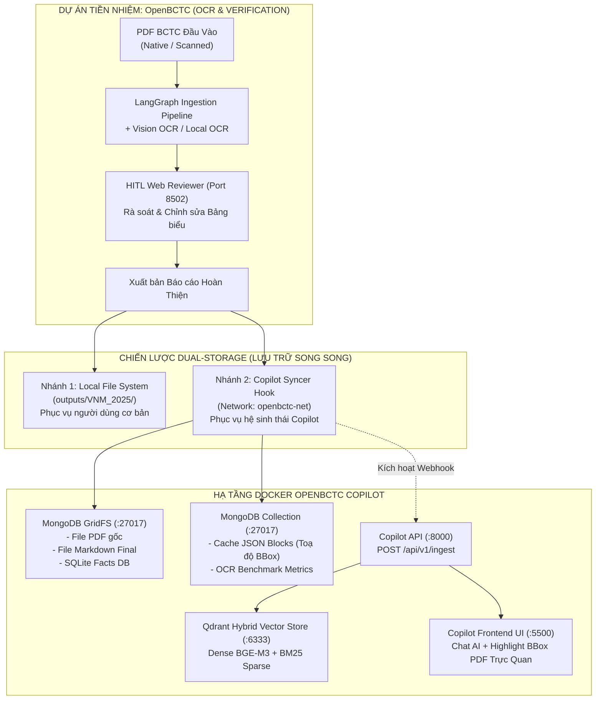
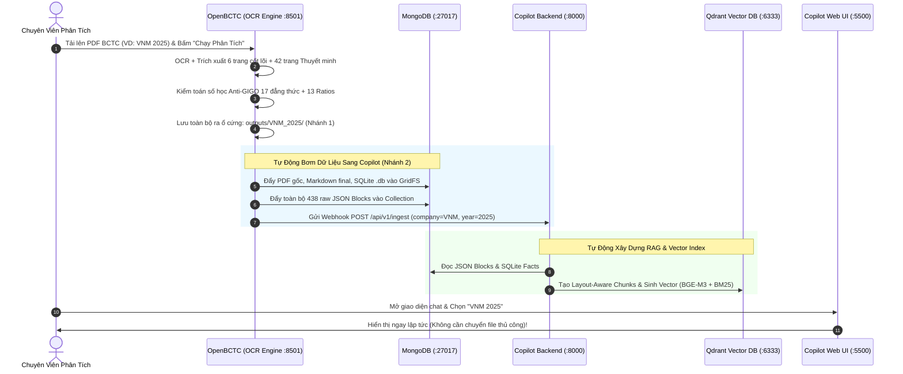

# 🚀 Kế Hoạch & Hướng Dẫn Tích Hợp Toàn Diện OpenBCTC & OpenBCTC Copilot
## Dual-Storage Architecture & Dockerized Automation Pipeline

> **Tài liệu đặc tả kỹ thuật tích hợp**  
> **Hệ thống nguồn:** [OpenBCTC](file:///d:/OpenBCTC/) (OCR, Parser, Bóc tách TT200, Kiểm toán Anti-GIGO & HITL Table Editor)  
> **Hệ thống đích:** [OpenBCTC Copilot](file:///d:/OpenBCTC%20Copilot/) (Dual-Engine RAG, SQL Fact Engine, LangGraph Multi-Agent, Visual Grounding trên Docker)  
> **Mục tiêu:** Tạo nên quy trình **Zero-Touch** — mỗi khi OpenBCTC xử lý xong BCTC, dữ liệu tự động đồng bộ sang hạ tầng Docker của Copilot để người dùng chat, phân tích và trích dẫn trực quan ngay lập tức mà không cần sao chép thủ công.

---

## 1. Bối Cảnh & Kiến Trúc Dual-Storage (Lưu Trữ Song Song)

Dự án tiền nhiệm **OpenBCTC** chuyên trách công việc nặng về thị giác máy tính và chuẩn hóa văn bản kế toán (OCR, bóc tách cấu trúc, đối chiếu 17 đẳng thức Anti-GIGO Thông tư 200). Dự án kế nhiệm **OpenBCTC Copilot** vận hành hệ thống AI đàm thoại tài chính chuyên sâu với đồ thị LangGraph, SQL Fact Engine và Qdrant Hybrid Search.

Để hai hệ thống kết nối mượt mà mà **không làm xáo trộn thói quen của người dùng độc lập**, kiến trúc tích hợp áp dụng triết lý **"Dual-Storage"**:



### Hai nhánh lưu trữ đáp ứng trọn vẹn 2 tệp người dùng:
1. **Người dùng phổ thông (Standalone OpenBCTC):** Không cần cài Docker hay MongoDB. Hệ thống tiếp tục tạo và lưu file vào thư mục cục bộ `outputs/<mã_ck>_<năm>/` (gồm PDF, Markdown, SQLite database `benchmark_*.db`, JSON metrics). Họ có thể mở file trực tiếp, kiểm tra bảng tính, copy-paste tự do.
2. **Người dùng hệ sinh thái (OpenBCTC Copilot):** Khi bật Docker stack của Copilot, OpenBCTC tự động "bơm" (Push) toàn bộ tài sản dữ liệu lên MongoDB GridFS và Collections, đồng thời kích hoạt Copilot API tự động index vào Qdrant. Người dùng mở giao diện Copilot là có thể hỏi đáp số liệu và xem highlight PDF tức thì.

---

## 2. Khế Ước Dữ Liệu Thực Tế Giữa 2 Hệ Thống (Data Contract)

Dưới đây là bảng đối chiếu chính xác giữa các tài sản dữ liệu do OpenBCTC sản xuất và đích đến tương ứng trong hệ thống Copilot:

| Tài Sản Dữ Liệu | Đường Dẫn Thực Tế Tại OpenBCTC | Điểm Đến Tại OpenBCTC Copilot | Mục Đích Sử Dụng |
| :--- | :--- | :--- | :--- |
| **PDF Báo Cáo Gốc** | `pdf_files/{company}_{year}.pdf` hoặc `data/uploads/...` | **MongoDB GridFS**<br>`{company_lower}_{year}.pdf` | Stream nhanh cho Frontend UI vẽ khung highlight toạ độ `bbox` |
| **Markdown Hoàn Thiện** | `outputs/{company}_{year}/{company}_{year}_financial_report_final.md` | **MongoDB GridFS**<br>`{company_lower}_{year}_final.md` | Cung cấp ngữ cảnh toàn văn và cấu trúc TOC Tree cho LLM Reasoning |
| **SQLite Facts DB** | `outputs/{company}_{year}/benchmark_{company}_{year}.db` | **MongoDB GridFS** + Mount Volume<br>`benchmark_{company_lower}_{year}.db` | Nguồn cung cấp số liệu cho **Deterministic SQL Fact Engine** (224 facts, 13 ratios) |
| **Cache JSON Blocks** | `outputs/{company}_{year}/cache/notes/page_*.json` | **MongoDB Collection**<br>`document_blocks` | Khối nguyên tử có số trang `page` & toạ độ `bbox` dùng để nạp vào Qdrant Hybrid RAG |
| **Benchmark Metrics** | `outputs/{company}_{year}/{company}_{year}_ocr_benchmark_metrics.json` | **MongoDB Collection**<br>`ocr_benchmarks` | Báo cáo kiểm toán Anti-GIGO (17 đẳng thức) và giám sát hiệu năng OCR |
| **Ảnh Crop Bảng Biểu** | `outputs/{company}_{year}/cache/table_crops/*.png` | **MongoDB GridFS** (Tùy chọn)<br>hoặc Volume tĩnh | Đối chiếu kiểm toán thị giác độ phân giải cao 200 DPI |

---

## 3. Các Bước Cấu Trúc Lại OpenBCTC (Implementation Guide)

### Bước 3.1: Bổ Sung Thư Viện Kết Nối
Mở môi trường ảo của dự án `OpenBCTC` và cài đặt các thư viện cần thiết:
```bash
pip install pymongo motor httpx pydantic
```
*(Hoặc thêm vào `pyproject.toml` / `requirements.txt` của OpenBCTC).*

---

### Bước 3.2: Cấu Hình Biến Môi Trường (`.env`)
Thêm các biến cấu hình sau vào tệp `.env` của `OpenBCTC`:
```dotenv
# =====================================================================
# CẤU HÌNH TÍCH HỢP VỚI HỆ SINH THÁI OPENBCTC COPILOT
# =====================================================================
# Bật/tắt chế độ tự động đồng bộ sang Copilot (Mặc định: true)
ENABLE_COPILOT_SYNC=true

# Kết nối MongoDB của Copilot (Chạy ngoài Docker dùng localhost:27017, trong Docker network dùng mongodb:27017)
MONGO_URI=mongodb://localhost:27017
MONGO_DB=openbctc

# Địa chỉ Copilot Backend API để gửi webhook tự động index RAG (Tùy chọn)
COPILOT_API_URL=http://localhost:8000
```

---

### Bước 3.3: Xây Dựng Module Đồng Bộ Chuyên Trách: `src/uploader/copilot_syncer.py`
Tạo mới tệp [`src/uploader/copilot_syncer.py`](file:///d:/OpenBCTC/src/uploader/copilot_syncer.py) trong dự án OpenBCTC.

> **Đặc điểm thiết kế:**
> - Tuân thủ nguyên tắc **Lean Service**: Tự chủ, không làm treo đồ thị LangGraph.
> - **Graceful Degradation (Suy giảm an toàn):** Nếu MongoDB chưa bật hoặc kết nối thất bại, service chỉ ghi log cảnh báo nhẹ, **tuyệt đối không gây crash** pipeline OCR cục bộ.

```python
"""src/uploader/copilot_syncer.py — Service đồng bộ dữ liệu OpenBCTC sang OpenBCTC Copilot."""

from __future__ import annotations

import glob
import json
import logging
import os
from pathlib import Path
from typing import Any

logger = logging.getLogger("OpenBCTC.Syncer")

try:
    from pymongo import MongoClient
    import gridfs
    PYMONGO_AVAILABLE = True
except ImportError:
    PYMONGO_AVAILABLE = False
    logger.warning("Thư viện 'pymongo' chưa được cài đặt. Đồng bộ Copilot sẽ bị vô hiệu hóa.")

try:
    import httpx
    HTTPX_AVAILABLE = True
except ImportError:
    HTTPX_AVAILABLE = False


class CopilotSyncer:
    """Đồng bộ tài sản OCR từ outputs/ của OpenBCTC sang MongoDB GridFS & Copilot API."""

    def __init__(
        self,
        mongo_uri: str | None = None,
        db_name: str | None = None,
        copilot_api_url: str | None = None,
        enabled: bool | None = None,
    ) -> None:
        self.enabled = (
            enabled
            if enabled is not None
            else os.getenv("ENABLE_COPILOT_SYNC", "true").lower() in ("true", "1", "yes")
        )
        self.mongo_uri = mongo_uri or os.getenv("MONGO_URI", "mongodb://localhost:27017")
        self.db_name = db_name or os.getenv("MONGO_DB", "openbctc")
        self.copilot_api_url = copilot_api_url or os.getenv("COPILOT_API_URL", "http://localhost:8000")

    def sync_company_run(
        self,
        company: str,
        year: int,
        output_dir: Path | str,
        pdf_path: Path | str | None = None,
        trigger_ingest: bool = True,
    ) -> dict[str, Any]:
        """
        Bơm toàn bộ tài sản của một doanh nghiệp vào MongoDB của Copilot.
        
        Args:
            company: Mã cổ phiếu (VD: 'VNM').
            year: Năm tài chính (VD: 2025).
            output_dir: Thư mục chứa kết quả (VD: 'outputs/VNM_2025').
            pdf_path: Đường dẫn file PDF gốc.
            trigger_ingest: Tự động gọi Copilot API để index Qdrant.
        """
        if not self.enabled:
            logger.info("Chế độ đồng bộ Copilot đang TẮT (ENABLE_COPILOT_SYNC=false). Bỏ qua.")
            return {"status": "SKIPPED", "reason": "SYNC_DISABLED"}

        if not PYMONGO_AVAILABLE:
            logger.warning("Thiếu thư viện pymongo. Bỏ qua đồng bộ Copilot.")
            return {"status": "SKIPPED", "reason": "PYMONGO_MISSING"}

        out_path = Path(output_dir).resolve()
        if not out_path.exists():
            logger.error("Thư mục output không tồn tại: %s", out_path)
            return {"status": "ERROR", "reason": "OUTPUT_NOT_FOUND"}

        company_upper = company.upper()
        company_lower = company.lower()
        clean_stem = f"{company_upper}_{year}"

        logger.info("🚀 Bắt đầu đồng bộ dữ liệu [%s - %s] sang Copilot...", company_upper, year)

        try:
            # Kết nối Mongo với timeout 3 giây để tránh treo máy nếu Docker chưa bật
            client = MongoClient(self.mongo_uri, serverSelectionTimeoutMS=3000)
            client.admin.command("ping")
            db = client[self.db_name]
            fs = gridfs.GridFS(db)
            blocks_collection = db["document_blocks"]
            benchmarks_collection = db["ocr_benchmarks"]
        except Exception as e:
            logger.warning("⚠️ Không thể kết nối MongoDB (%s). Dữ liệu vẫn an toàn tại thư mục local! Chi tiết: %s", self.mongo_uri, e)
            return {"status": "WARNING", "reason": "MONGO_UNREACHABLE", "detail": str(e)}

        synced_items = []

        # -------------------------------------------------------------
        # 1. ĐẨY FILE PDF GỐC VÀO GRIDFS (Dùng cho Streaming & Visual BBox)
        # -------------------------------------------------------------
        resolved_pdf = None
        if pdf_path and Path(pdf_path).exists():
            resolved_pdf = Path(pdf_path).resolve()
        else:
            # Fallback tìm kiếm trong thư mục gốc
            candidates = [
                Path(f"pdf_files/{clean_stem}.pdf"),
                Path(f"pdf_files/{company_upper}.pdf"),
                out_path / f"{clean_stem}.pdf",
            ]
            for cand in candidates:
                if cand.exists():
                    resolved_pdf = cand.resolve()
                    break

        if resolved_pdf and resolved_pdf.exists():
            pdf_filename = f"{company_lower}_{year}.pdf"
            # Xóa bản ghi cũ cùng tên nếu có
            for old in fs.find({"filename": pdf_filename}):
                fs.delete(old._id)
            with open(resolved_pdf, "rb") as f:
                pdf_id = fs.put(
                    f,
                    filename=pdf_filename,
                    metadata={"company": company_upper, "year": year, "type": "pdf", "source": str(resolved_pdf)}
                )
            logger.info("  ✓ Đã nạp PDF vào GridFS: %s (ID: %s)", pdf_filename, pdf_id)
            synced_items.append("pdf")

        # -------------------------------------------------------------
        # 2. ĐẨY BÁO CÁO MARKDOWN HOÀN THIỆN VÀO GRIDFS
        # -------------------------------------------------------------
        md_final = out_path / f"{clean_stem}_financial_report_final.md"
        if not md_final.exists():
            md_final = out_path / f"{clean_stem}_financial_report.md"

        if md_final.exists():
            md_filename = f"{company_lower}_{year}_final.md"
            for old in fs.find({"filename": md_filename}):
                fs.delete(old._id)
            with open(md_final, "rb") as f:
                md_id = fs.put(
                    f,
                    filename=md_filename,
                    metadata={"company": company_upper, "year": year, "type": "markdown"}
                )
            logger.info("  ✓ Đã nạp Markdown vào GridFS: %s (ID: %s)", md_filename, md_id)
            synced_items.append("markdown")

        # -------------------------------------------------------------
        # 3. ĐẨY FILE SQLITE CSDL FACTS (Dùng cho SQL Fact Engine)
        # -------------------------------------------------------------
        db_file = out_path / f"benchmark_{clean_stem}.db"
        if db_file.exists():
            sqlite_filename = f"benchmark_{company_lower}_{year}.db"
            for old in fs.find({"filename": sqlite_filename}):
                fs.delete(old._id)
            with open(db_file, "rb") as f:
                db_id = fs.put(
                    f,
                    filename=sqlite_filename,
                    metadata={"company": company_upper, "year": year, "type": "sqlite"}
                )
            logger.info("  ✓ Đã nạp SQLite Facts DB vào GridFS: %s (ID: %s)", sqlite_filename, db_id)
            synced_items.append("sqlite")

        # -------------------------------------------------------------
        # 4. ĐẨY CÁC FILE JSON BLOCKS TRONG CACHE (Dùng cho Qdrant Chunking & BBox)
        # -------------------------------------------------------------
        notes_cache_dir = out_path / "cache" / "notes"
        if notes_cache_dir.exists():
            json_files = list(notes_cache_dir.glob("page_*.json"))
            total_blocks = 0
            # Làm mới các blocks cũ của công ty & năm này
            blocks_collection.delete_many({"company": company_upper, "year": year})

            inserted_docs = []
            for jf in json_files:
                try:
                    with open(jf, "r", encoding="utf-8") as f:
                        data = json.load(f)
                    blocks = data if isinstance(data, list) else data.get("blocks", [])
                    for b in blocks:
                        b["company"] = company_upper
                        b["year"] = year
                        b["source_file"] = jf.name
                        inserted_docs.append(b)
                except Exception as ex:
                    logger.warning("Bỏ qua file json lỗi %s: %s", jf.name, ex)

            if inserted_docs:
                blocks_collection.insert_many(inserted_docs)
                total_blocks = len(inserted_docs)
                logger.info("  ✓ Đã nạp %d JSON Blocks vào Collection 'document_blocks'", total_blocks)
                synced_items.append(f"json_blocks ({total_blocks})")

        # -------------------------------------------------------------
        # 5. ĐẨY BENCHMARK METRICS (Anti-GIGO Report) VÀO COLLECTION
        # -------------------------------------------------------------
        metrics_file = out_path / f"{clean_stem}_ocr_benchmark_metrics.json"
        if metrics_file.exists():
            with open(metrics_file, "r", encoding="utf-8") as f:
                metrics_data = json.load(f)
            benchmarks_collection.update_one(
                {"company": company_upper, "year": year},
                {"$set": {"company": company_upper, "year": year, "metrics": metrics_data}},
                upsert=True
            )
            logger.info("  ✓ Đã cập nhật OCR Benchmark Metrics vào Collection 'ocr_benchmarks'")
            synced_items.append("metrics")

        # -------------------------------------------------------------
        # 6. TRIGGER TỰ ĐỘNG INGEST SANG COPILOT QDRANT
        # -------------------------------------------------------------
        if trigger_ingest and HTTPX_AVAILABLE:
            try:
                ingest_endpoint = f"{self.copilot_api_url.rstrip('/')}/api/v1/ingest"
                with httpx.Client(timeout=5.0) as client_http:
                    res = client_http.post(
                        ingest_endpoint,
                        json={"company": company_upper, "year": year}
                    )
                    if res.status_code in (200, 201, 202):
                        logger.info("  🎉 Đã kích hoạt Ingestion tự động tại Copilot: %s", res.text)
                        synced_items.append("copilot_triggered")
                    else:
                        logger.info("  ℹ️ Copilot Ingestion endpoint trả về mã: %d (Có thể chạy thủ công sau).", res.status_code)
            except Exception as ex:
                logger.info("  ℹ️ Copilot API chưa chạy hoặc không phản hồi (%s). Dữ liệu đã sẵn sàng trong MongoDB.", ex)

        logger.info("✨ ĐỒNG BỘ THÀNH CÔNG VÀO COPILOT CHO [%s - %s]: %s", company_upper, year, synced_items)
        return {"status": "SUCCESS", "synced_items": synced_items}
```

---

### Bước 3.4: Điểm Cắm Hook Trong Pipeline OpenBCTC
Để tự động kích hoạt sau khi OCR hoặc Review xong, bạn gắn hook vào 2 vị trí quan trọng:

#### Vị trí 1: Cuối hàm `run_full_pipeline` trong [`interface.py`](file:///d:/OpenBCTC/interface.py)
Tìm tới dòng sau khi ghi xong tệp `metrics_json_path` (~dòng 543) và thêm đoạn mã sau:

```python
    # GẮN HOOK ĐỒNG BỘ SANG COPILOT (DUAL-STORAGE)
    try:
        from src.uploader.copilot_syncer import CopilotSyncer
        syncer = CopilotSyncer()
        sync_res = syncer.sync_company_run(
            company=company,
            year=year,
            output_dir=run_dir,
            pdf_path=pdf_file,
            trigger_ingest=True,
        )
        if sync_res.get("status") == "SUCCESS":
            JobState.logs.append("✓ Đã đồng bộ tài nguyên tức thì sang OpenBCTC Copilot (MongoDB GridFS)!")
    except Exception as e:
        logger.warning("Không thể kích hoạt CopilotSyncer: %s", e)
```

#### Vị trí 2: Khi người dùng bấm "Lưu & Xuất Hoàn Tất" trên HITL Reviewer ([`serve_md_editor.py`](file:///d:/OpenBCTC/serve_md_editor.py))
Khi kiểm toán viên hoàn tất sửa bảng biểu và lưu file `*_financial_report_final.md`, gọi:
```python
from src.uploader.copilot_syncer import CopilotSyncer
CopilotSyncer().sync_company_run(company=comp, year=yr, output_dir=run_dir)
```

---

## 4. Đóng Gói Docker Cho OpenBCTC (Containerization)

Để cả `OpenBCTC` và `OpenBCTC Copilot` có thể chạy chung hạ tầng hoặc tự động gọi nhau qua container, chúng ta chuẩn bị `Dockerfile` và `docker-compose` cho OpenBCTC.

### Bước 4.1: Tạo `Dockerfile` Cho OpenBCTC
Tạo tệp `Dockerfile` tại thư mục gốc `OpenBCTC`:

```dockerfile
# Sử dụng Python 3.11 Slim làm base image
FROM python:3.11-slim

# Thiết lập thư mục làm việc
WORKDIR /app

# Cài đặt các thư viện hệ thống cần thiết cho OpenCV, MuPDF và OCR
RUN apt-get update && apt-get install -y --no-install-recommends \
    build-essential \
    libgl1 \
    libglib2.0-0 \
    libgomp1 \
    libspatialindex-dev \
    curl \
    && rm -rf /var/lib/apt/lists/*

# Copy cấu hình dependencies
COPY pyproject.toml .

# Cài đặt dependencies
RUN pip install --no-cache-dir --upgrade pip && \
    pip install --no-cache-dir \
    pdfplumber PyMuPDF opencv-python-headless \
    pydantic langgraph langchain-core \
    pymongo motor httpx psutil

# Copy toàn bộ mã nguồn
COPY . /app

# Tạo các thư mục lưu trữ dữ liệu
RUN mkdir -p /app/data /app/outputs /app/pdf_files

# Mở các cổng: 8501 (Main Web App) và 8502 (HITL Editor)
EXPOSE 8501 8502

# Lệnh khởi chạy mặc định: Web Interface
CMD ["python", "interface.py", "--port", "8501", "--no-browser"]
```

---

### Bước 4.2: Tích Hợp Vào Docker Compose Mạng Chung (`openbctc-network`)
Để OpenBCTC và Copilot giao tiếp nội bộ trong Docker, 2 dự án sẽ dùng chung mạng `openbctc-network`.

**Trong `docker-compose.yml` của OpenBCTC:**
```yaml
version: '3.8'

networks:
  openbctc-net:
    external: true  # Sử dụng chung network đã tạo bởi Copilot

services:
  openbctc-ocr:
    build:
      context: .
      dockerfile: Dockerfile
    container_name: openbctc_ocr_engine
    restart: unless-stopped
    ports:
      - "8501:8501"
      - "8502:8502"
    environment:
      - MONGO_URI=mongodb://mongodb:27017
      - MONGO_DB=openbctc
      - COPILOT_API_URL=http://copilot-api:8000
      - ENABLE_COPILOT_SYNC=true
    volumes:
      - ./data:/app/data
      - ./outputs:/app/outputs
      - ./pdf_files:/app/pdf_files
    networks:
      - openbctc-net
```

---

## 5. Quy Trình Vận Hành Thống Nhất & Tự Động 100% (Zero-Touch Workflow)



### Các bước thao tác thực tế:

1. **Khởi động hạ tầng Copilot:**
   ```bash
   # Tại thư mục OpenBCTC Copilot:
   docker compose up -d mongodb qdrant copilot-api copilot-ui
   ```
   *Lúc này MongoDB (`27017`) và Qdrant (`6333`) đã sẵn sàng.*

2. **Chạy bóc tách tại OpenBCTC:**
   - Mở giao diện OpenBCTC: `http://localhost:8501`
   - Kéo thả file PDF `VNM_2025.pdf` và bấm **"Bắt đầu xử lý"** (hoặc chạy CLI `python interface.py --pdf ...`).
   - Sau khi hoàn thành và rà soát bảng biểu tại cổng `8502`, tệp Markdown hoàn thiện và SQLite database được tạo ra.

3. **Tự động nhận diện:**
   - Module `CopilotSyncer` tự động nuốt file PDF, MD, DB và các JSON blocks vào MongoDB.
   - Copilot API nạp vào Qdrant.

4. **Trải nghiệm đàm thoại:**
   - Mở giao diện Copilot `http://localhost:5500`.
   - Chọn công ty `VNM (2025)` và hỏi:
     > *"Tổng nợ vay ngắn hạn là bao nhiêu và chi tiết khoản vay ngân hàng trong thuyết minh?"*
   - Copilot tự động lấy số liệu từ SQLite DB (Deterministic) + tìm kiếm giải trình trong Qdrant + vẽ khung đỏ highlight chính xác toạ độ bảng biểu trên PDF gốc!

---

## 6. Ma Trận Xử Lý Lỗi & Khả Năng Chịu Lỗi (Fault-Tolerance Matrix)

| Tình Huống Phát Sinh | Phản Ứng Của OpenBCTC | Phản Ứng Của OpenBCTC Copilot | Biện Pháp Khắc Phục |
| :--- | :--- | :--- | :--- |
| **Chưa bật Docker / MongoDB** | Ghi log cảnh báo `MONGO_UNREACHABLE`. Vẫn lưu file đầy đủ ra `outputs/`. Không crash. | Chờ khi MongoDB bật, chạy lệnh `python migrate_to_mongo.py` để quét lại thư mục `outputs/`. | Tự động khôi phục hoàn toàn không mất mát dữ liệu. |
| **File PDF bị mờ, OCR có sai số** | Vòng lặp Vision Zoom Corrector sửa lỗi; HITL Editor (Port 8502) cho phép sửa tay. | Sau khi người dùng lưu bản `_final.md`, syncer tự ghi đè bản mới nhất lên GridFS. | Đảm bảo Copilot luôn đọc bản dữ liệu đã được con người duyệt kỹ nhất. |
| **Mất kết nối mạng / Timeout** | Thử lại với timeout 3 giây; nếu thất bại thì bỏ qua và kết thúc tác vụ OCR. | Sử dụng dữ liệu cache trước đó nếu có. | Không ảnh hưởng đến tiến trình làm việc của người dùng. |

---

## 7. Tổng Kết

Với kế hoạch tích hợp theo mô hình **Dual-Storage** và cơ chế **Syncer Hook**:
- **Bảo toàn 100% tính nguyên bản:** Dự án OpenBCTC vẫn giữ trọn vẹn sự gọn nhẹ, linh hoạt cho người dùng truyền thống.
- **Tự động hóa hoàn toàn:** Xóa bỏ vĩnh viễn bước copy-paste thủ công các file `.db`, `.md`, `.json` giữa 2 dự án.
- **Khép kín hệ sinh thái:** Biến `OpenBCTC` thành động cơ tiền xử lý dữ liệu hoàn hảo, cấp nguồn cho `OpenBCTC Copilot` trở thành trợ lý AI phân tích tài chính hàng đầu.
