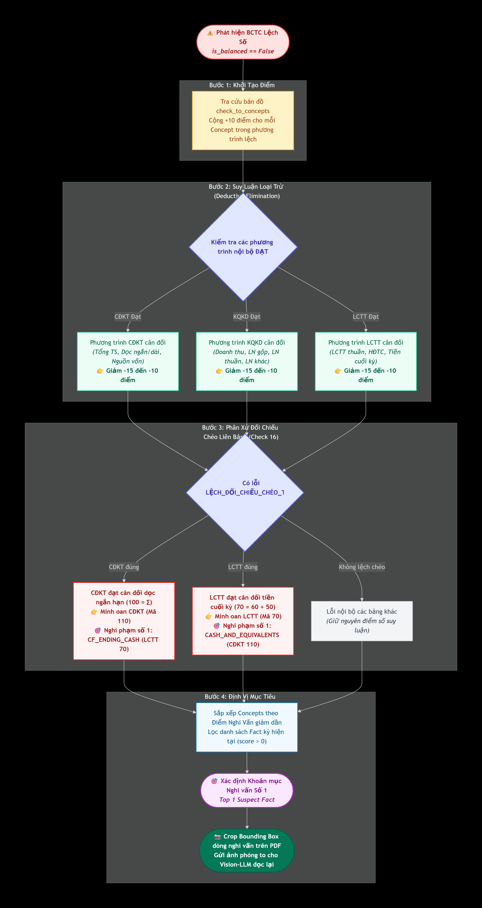

# Hệ Thống Kiểm Toán Số Học & Đẳng Thức Kế Toán (Accounting Invariants)

Tài liệu đặc tả toàn diện logic kiểm toán số học (Self-Auditing Verification Logic) và cơ chế suy luận loại trừ nghi vấn (Deductive Suspect Localization) trên **3 Báo cáo Tài chính Cốt lõi** theo Chuẩn mực Kế toán Việt Nam và **Thông tư 200/2014/TT-BTC** (mẫu B01-DN, B02-DN, B03-DN).

---

## 1. Nguyên Tắc & Quy Ước Kỹ Thuật (Design Principles)

1. **Phạm vi áp dụng:**
   - Áp dụng cho BCTC doanh nghiệp thông thường tuân thủ Thông tư 200/2014/TT-BTC.
   - Các hệ thống ngân hàng, tổ chức tín dụng, công ty chứng khoán hoặc bảo hiểm có biểu mẫu riêng sẽ có bộ quy tắc mở rộng độc lập.
2. **Quy ước dấu & tính toán an toàn (Sign Convention Invariance):**
   - Trên báo cáo in, các khoản chi phí, giảm trừ doanh thu hoặc dòng tiền chi ra thường được đặt trong ngoặc đơn `(x)` thể hiện số âm.
   - Để tránh rủi ro do OCR có thể bóc tách thành số âm hoặc số dương tuyệt đối, hệ thống chuẩn hóa bằng hàm `abs()` cho các chỉ tiêu chi phí/dòng tiền ra (ví dụ: `- abs(val_cogs)`).
3. **Nguyên tắc khoản mục con (Missing Sub-items Handling):**
   - Cộng tất cả các mã con OCR bóc tách được.
   - **Mã nào không xuất hiện trong báo cáo thì coi bằng 0**, không đặt ngưỡng số lượng mục con tùy tiện, đảm bảo phản ánh chính xác thực tế doanh nghiệp không phát sinh chỉ tiêu đó.
4. **Sai số làm tròn (Rounding Tolerance):**
   - Dung sai tương đối: `tolerance_ratio = 0.0001` (0.01%).
   - Dung sai tuyệt đối: `absolute_tolerance = 2.0` (cho phép chênh lệch đơn vị lẻ do làm tròn số học).
5. **Độc lập kỳ kế toán (Period Isolation):**
   - Chỉ đối chiếu các fact thuộc cùng kỳ báo cáo (`period_type == "current"` hoặc cùng niên độ `year`), không trộn lẫn số liệu kỳ này với số liệu kỳ trước (so sánh).

---

## 2. Chi Tiết 17 Đẳng Thức Kế Toán (Accounting Invariants)

  

### 2.1. Bảng Cân đối kế toán (Balance Sheet - CĐKT)

| STT | Tên Bài Kiểm Tra | Mã Số Chuẩn | Công Thức Toán Học / Đẳng Thức Kế Toán | Ghi Chú |
| :---: | :--- | :---: | :--- | :--- |
| **1** | `TOTAL_ASSETS == TOTAL_RESOURCES` | 270 == 440 | $\text{Mã 270} == \text{Mã 440}$ | Cân đối tài sản và nguồn vốn. |
| **2** | `TOTAL_ASSETS == CURRENT + NON_CURRENT` | 270 == 100 + 200 | $\text{Mã 270} == \text{Mã 100} + \text{Mã 200}$ | Tổng tài sản = Ngắn hạn + Dài hạn. |
| **3** | `CURRENT_ASSETS == SUM_CHILDREN` | 100 == ∑(110..150) | $\text{Mã 100} == 110 + 120 + 130 + 140 + 150$ | Tiền + Đầu tư ngắn + Phải thu + Hàng tồn kho + TS ngắn khác. |
| **4** | `NON_CURRENT_ASSETS == SUM_CHILDREN` | 200 == ∑(210..260) | $\text{Mã 200} == 210 + 220 + 230 + 240 + 250 + 260$ | Phải thu dài + TSCĐ + BĐS đầu tư + Dở dang dài + Đầu tư dài + TS dài khác. |
| **5** | `TOTAL_RESOURCES == LIABILITIES + EQUITY` | 440 == 300 + 400 | $\text{Mã 440} == \text{Mã 300} + \text{Mã 400}$ | Tổng nguồn vốn = Nợ phải trả + Vốn chủ sở hữu. |
| **6** | `LIABILITIES == CURRENT + NON_CURRENT` | 300 == 310 + 330 | $\text{Mã 300} == \text{Mã 310} + \text{Mã 330}$ | Nợ phải trả = Nợ ngắn hạn + Nợ dài hạn. |

### 2.2. Báo cáo Kết quả hoạt động kinh doanh (Income Statement - KQKD)

| STT | Tên Bài Kiểm Tra | Mã Số Chuẩn | Công Thức Toán Học / Đẳng Thức Kế Toán | Ghi Chú |
| :---: | :--- | :---: | :--- | :--- |
| **7** | `NET_REVENUE == GROSS_REVENUE - REVENUE_DEDUCTIONS` | 10 == 01 - 02 | $\text{Mã 10} == \text{Mã 01} - \|\text{Mã 02}\|$ | Doanh thu thuần = Doanh thu gộp - Các khoản giảm trừ. |
| **8** | `GROSS_PROFIT == NET_REVENUE - COGS` | 20 == 10 - 11 | $\text{Mã 20} == \text{Mã 10} - \|\text{Mã 11}\|$ | Lợi nhuận gộp = Doanh thu thuần - Giá vốn hàng bán. |
| **9** | `OPERATING_PROFIT == GROSS_PROFIT + FINANCIAL - EXPENSES` | 30 == 20+21-22-25-26 | $\text{Mã 30} == \text{Mã 20} + 21 - \|22\| - \|25\| - \|26\|$ | LN thuần HĐKD = LN gộp + DT tài chính - CP tài chính - CP bán hàng - CP quản lý. |
| **10** | `OTHER_PROFIT == OTHER_INCOME - OTHER_EXPENSES` | 40 == 31 - 32 | $\text{Mã 40} == \|\text{Mã 31}\| - \|\text{Mã 32}\|$ | Lợi nhuận khác = Thu nhập khác - Chi phí khác. |
| **11** | `PROFIT_BEFORE_TAX == OPERATING_PROFIT + OTHER_PROFIT` | 50 == 30 + 40 | $\text{Mã 50} == \text{Mã 30} + \text{Mã 40}$ | Tổng lợi nhuận trước thuế = LN thuần HĐKD + LN khác. |
| **12** | `NET_PROFIT == PROFIT_BEFORE_TAX - TAXES` | 60 == 50 - 51 - 52 | $\text{Mã 60} == \text{Mã 50} - \|\text{Mã 51}\| - \text{Mã 52}$ | LN sau thuế = LN trước thuế - Thuế TNDN hiện hành - Thuế TNDN hoãn lại. |

### 2.3. Báo cáo Lưu chuyển tiền tệ (Cash Flow Statement - LCTT)

| STT | Tên Bài Kiểm Tra | Mã Số Chuẩn | Công Thức Toán Học / Đẳng Thức Kế Toán | Ghi Chú |
| :---: | :--- | :---: | :--- | :--- |
| **13** | `CF_NET_CHANGE == OPERATING + INVESTING + FINANCING` | 50 == 20 + 30 + 40 | $\text{Mã 50} == \text{Mã 20} + \text{Mã 30} + \text{Mã 40}$ | Lưu chuyển tiền thuần trong kỳ = Tổng dòng tiền KD (20) + ĐT (30) + TC (40). |
| **14** | `CF_ENDING_CASH == BEGINNING + NET_CHANGE` | 70 == 60 + 50 (+ 61) | $\text{Mã 70} == \text{Mã 60} + \text{Mã 50} + \text{Mã 61}$ | Tiền cuối kỳ = Tiền đầu kỳ + LCTT thuần + Ảnh hưởng tỷ giá (nếu có Mã 61). |
| **15** | `CF_NET_FINANCING == 31 - 32 + 33 - 34 - 35 - 36` | 40 == ∑ con HĐTC | $\text{Mã 40} == 31 - 32 + 33 - 34 - 35 - 36$ | Đầy đủ 6 mã con: Thu góp vốn (31) - Trả vốn góp (32) + Đi vay (33) - Trả gốc vay (34) - Trả nợ thuê TC (35) - Trả cổ tức (36). |

### 2.4. Đối Chiếu Chéo Liên Bảng (Cross-Statement Reconciliations)

| STT | Tên Bài Kiểm Tra | Liên Bảng | Đẳng Thức Kiểm Tra | Cơ Chế Phát Hiện Lỗi & Ý Nghĩa Kiểm Toán |
| :---: | :--- | :---: | :--- | :--- |
| **16** | `CROSS_CHECK_CASH == CF_ENDING vs BS_CASH` | **LCTT vs CĐKT** | $\text{LCTT Mã 70} == \text{CĐKT Mã 110}$ | Tiền và tương đương tiền cuối kỳ trên LCTT bắt buộc phải bằng Tiền & tương đương tiền trên Bảng CĐKT tại cùng thời điểm. |
| **17** | `CROSS_CHECK_PBT == CF_01 vs IS_50` | **LCTT vs KQKD** | $\text{LCTT Mã 01} == \text{KQKD Mã 50}$ | Khi LCTT lập theo phương pháp gián tiếp, dòng xuất phát điểm Mã 01 (LN trước thuế) phải khớp 100% với Mã 50 trên Báo cáo KQKD. |

---

## 3. Cơ Chế Suy Luận Loại Trừ Nghi Vấn (Deductive Suspect Localization)

Khi `AccountingVerifier` phát hiện sai lệch số học (`is_balanced == False`), thay vì gửi toàn bộ 50 dòng của bảng vào LLM để OCR lại, bộ điều khiển [`VisionZoomCorrector`](../src/verifier/vision_zoom_corrector.py) áp dụng quy tắc suy luận loại trừ:

  

---

## 4. Mã Nguồn Tham Chiếu (Source Code References)

- **Bộ tự kiểm toán số học (Verification Engine):** [`src/verifier/accounting_verifier.py`](../src/verifier/accounting_verifier.py)
- **Bộ suy luận loại trừ & cắt ảnh zoom (Deductive Locator & Cropper):** [`src/verifier/vision_zoom_corrector.py`](../src/verifier/vision_zoom_corrector.py)
- **Từ điển Canonical Concept & Ánh xạ TT200 (Financial Ontology):** [`src/extractor/ontology.py`](../src/extractor/ontology.py)
- **Bộ kiểm thử tự động (Unit Test Suite):**
  - [`tests/test_verifier.py`](../tests/test_verifier.py)
  - [`tests/test_vision_zoom_corrector.py`](../tests/test_vision_zoom_corrector.py)