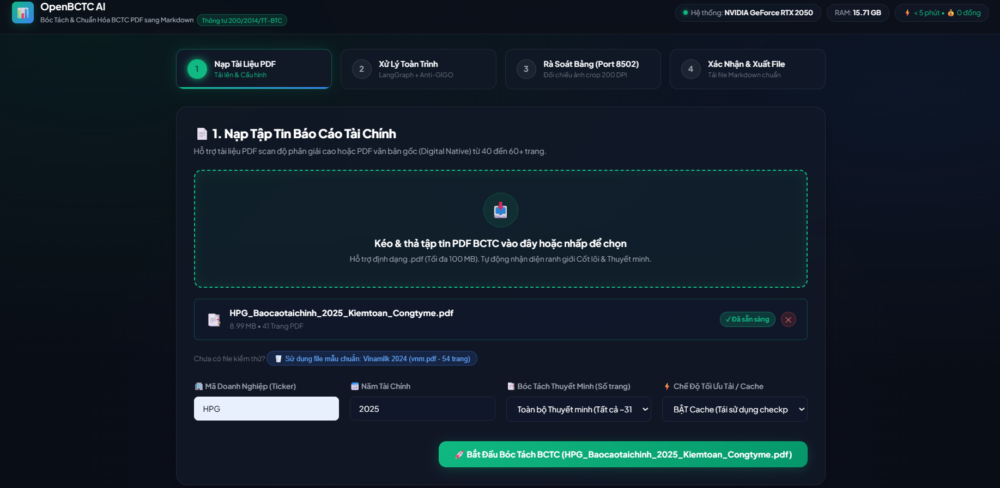
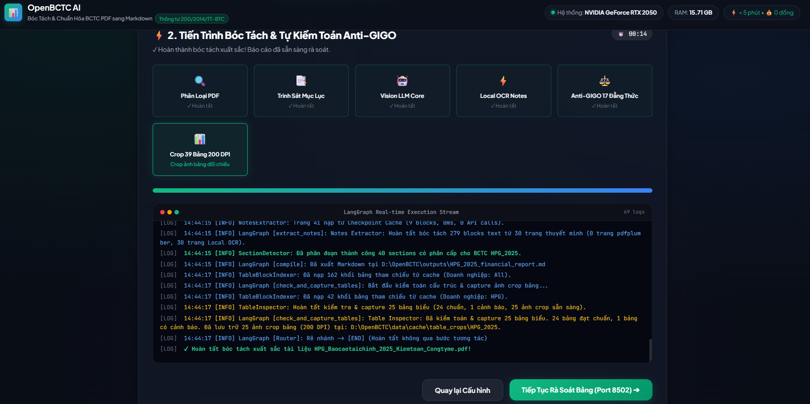
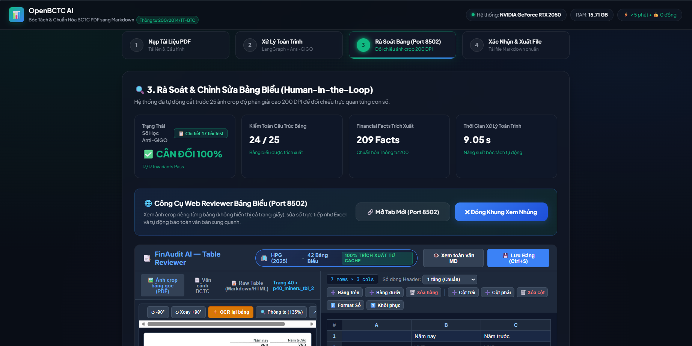
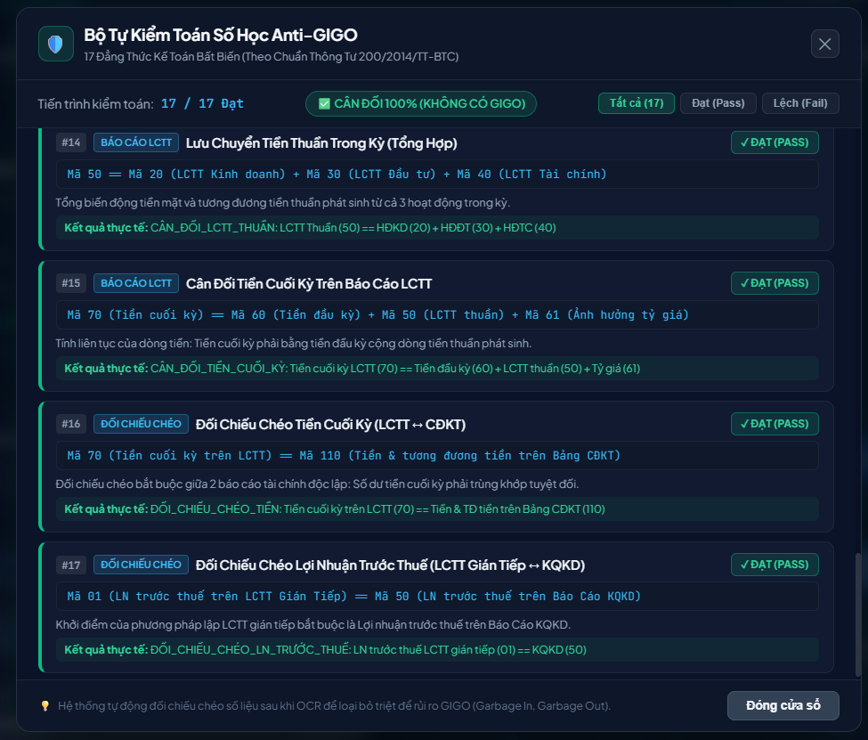
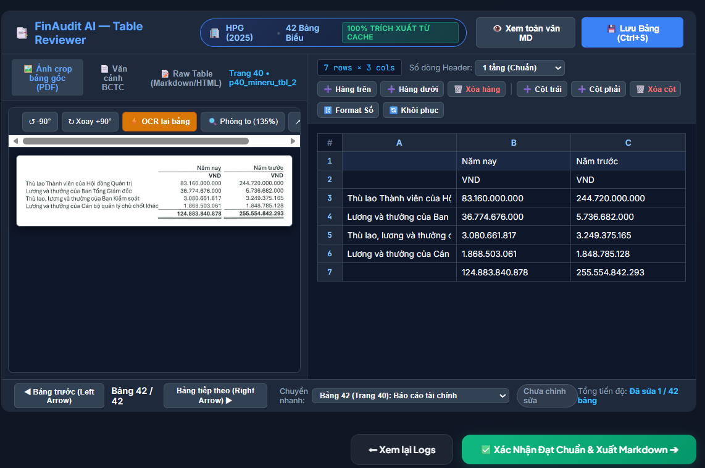
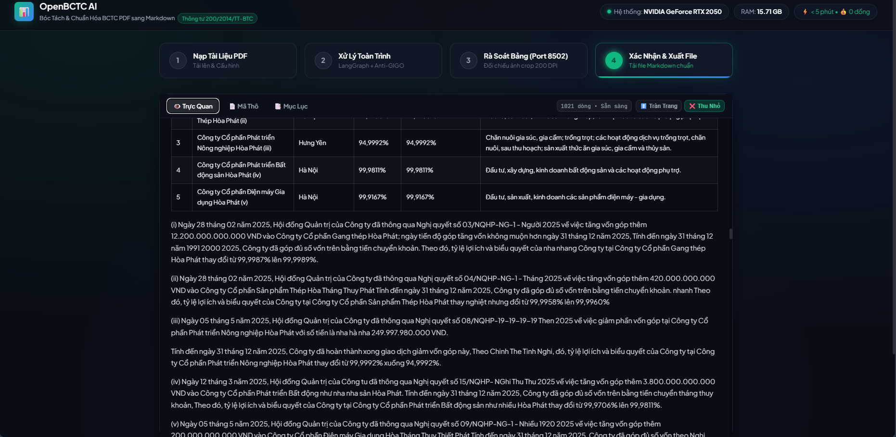
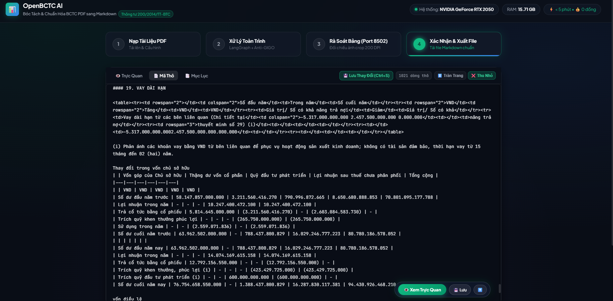
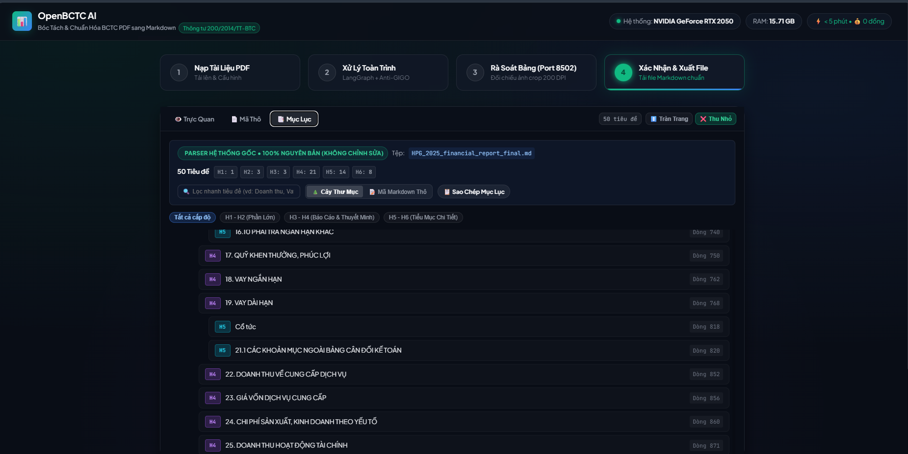

# Hướng Dẫn Cài Đặt Nhanh & Vận Hành Giao Diện Web OpenBCTC AI

> **Dành cho:** Người dùng, kiểm toán viên, chuyên viên phân tích tài chính muốn nhanh chóng cài đặt và sử dụng ứng dụng web OpenBCTC AI để bóc tách Báo cáo Tài chính (BCTC) PDF sang Markdown mà không cần đi sâu vào mã nguồn hay chi tiết kiến trúc ngầm.

---

## ⚡ 1. Cài Đặt Môi Trường Siêu Tốc (Dưới 3 Phút)

### Yêu Cầu Tối Thiểu
* **Hệ điều hành:** Windows 10/11, macOS, hoặc Linux (Ubuntu 20.04+).
* **Python:** Phiên bản `3.10` trở lên (`3.11` khuyến nghị).
* **Phần cứng:** Tối thiểu 8 GB RAM (16 GB khuyến nghị). Nếu có GPU NVIDIA (VRAM ≥ 4 GB), hệ thống sẽ tự động kích hoạt tăng tốc phần cứng cho Local OCR.

---

### Bước 1: Chuẩn Bị Môi Trường Ảo

Mở Terminal / PowerShell tại thư mục dự án `OpenBCTC`:

```bash
# Tạo môi trường ảo Python
python -m venv .venv

# Kích hoạt môi trường ảo:
# Trên Windows (PowerShell):
.venv\Scripts\Activate.ps1
# Trên Linux / macOS:
source .venv/bin/activate
```

---

### Bước 2: Cài Đặt Thư Viện Cần Thiết

```bash
# Nâng cấp pip và cài đặt toàn bộ gói phụ thuộc
pip install --upgrade pip
pip install -e .
```

> [!TIP]
> Nếu bạn sử dụng GPU NVIDIA và muốn chạy VietOCR với tốc độ tối đa, hãy đảm bảo PyTorch tương thích với CUDA đã được cài đặt:
> ```bash
> pip install torch torchvision --index-url https://download.pytorch.org/whl/cu121
> ```

---

### Bước 3: Thiết Lập Khóa API (Chỉ 1 Biến Môi Trường)

Hệ thống sử dụng **Gemini 2.0 Flash** (hoàn toàn miễn phí quota từ Google AI Studio) để đọc 4 bảng BCTC cốt lõi.

Tạo tệp `.env` tại thư mục gốc của dự án (sao chép từ `.env.example`):

```bash
# Windows PowerShell
cp .env.example .env
```

Mở tệp `.env` và điền khóa API của bạn:

```ini
# Vision OCR Provider (Miễn phí tại: https://aistudio.google.com/)
GEMINI_API_KEY=AIzaSyYourGeminiApiKeyHere
GEMINI_VISION_MODEL=gemini-2.0-flash

# Cấu hình OCR Cục bộ (Chạy offline 0 đồng cho phần Thuyết minh)
ENABLE_OCR_FALLBACK=true
OCR_PROVIDER=auto
```

*(Toàn bộ các trang Thuyết minh từ trang 13 đến hết sẽ được xử lý hoàn toàn Offline bằng mô hình OCR nội bộ, không tốn thêm bất kỳ token hay chi phí nào).*

---

## 🚀 2. Khởi Chạy Giao Diện Web

Chỉ cần chạy **duy nhất một dòng lệnh**:

```bash
python interface.py
```

Hệ thống sẽ khởi động máy chủ Web nội bộ và tự động mở trình duyệt tại:
👉 **`http://localhost:8501`**

```text
================================================================================
  🚀 OpenBCTC AI — GIAO DIỆN WEB TRỰC QUAN ĐANG HOẠT ĐỘNG
================================================================================
  👉 Truy cập Web App tại:   http://localhost:8501
  📄 File giao diện:         interface.html
  🌐 Port Rà Soát Bảng HITL: http://localhost:8502 (Tự động kích hoạt song song)
  ⌨️  Nhấn Ctrl + C trong Terminal để dừng máy chủ.
================================================================================
```

Ngay trên thanh Header của giao diện, hệ thống sẽ tự động quét và hiển thị thông số phần cứng thực tế của bạn (GPU đang chạy, tổng RAM máy tính và trạng thái sẵn sàng).

---

## 🧭 3. Quy Trình Vận Hành 4 Bước Trên Giao Diện

Giao diện được thiết kế theo quy trình dạng thẻ bước (Stepper) khép kín, trực quan và dễ tiếp cận:


---

### Bước 1: Nạp Tài Liệu PDF & Cấu Hình Đa Doanh Nghiệp



1. **Nạp tập tin PDF:**
   * Kéo & thả tệp BCTC định dạng `.pdf` (dung lượng tối đa 100 MB) vào khung tải lên hoặc nhấp chuột để chọn file từ máy tính.
   * Hỗ trợ mọi loại BCTC: PDF dạng văn bản gốc (Digital Native) hoặc PDF scan chụp thực tế của các doanh nghiệp Việt Nam (HPG, VNM, FPT, VIC, MWG...).
   * **Nút tiện ích thử nghiệm:** Nếu chưa có sẵn file PDF, nhấp vào nút *"🥛 Sử dụng file mẫu chuẩn: Vinamilk 2024 (vnm.pdf - 54 trang)"* để trải nghiệm ngay.

2. **Cấu hình trích xuất:**
   * **Mã Doanh Nghiệp (Ticker) & Năm Tài Chính:** Hệ thống sẽ tự động nhận diện từ trang bìa PDF, hoặc bạn có thể gõ thủ công mã (ví dụ: `VNM`, `HPG`).
   * **Bóc Tách Thuyết Minh:**
     * *Toàn bộ Thuyết minh (Mặc định):* Bóc tách toàn diện tất cả các trang thuyết minh chi tiết.
     * *Chạy nhanh 5 hoặc 10 trang đầu:* Phù hợp khi muốn kiểm tra thử độ chính xác của bảng trước khi chạy toàn văn.
     * *Chỉ bóc tách 4 BCTC cốt lõi:* Bỏ qua Thuyết minh để xuất kết quả trong vài giây.
   * **Chế Độ Tối Ưu Tải / Cache:** Mặc định bật cache để tái sử dụng checkpoint đĩa giúp xử lý siêu tốc. Khi muốn đo benchmark thực tế từ đầu, chọn *TẮT Cache*.

3. **Bắt đầu:** Nhấp nút màu xanh **"🚀 Bắt Đầu Bóc Tách BCTC"** để chuyển sang bước 2.

---

### Bước 2: Xử Lý Toàn Trình & Giám Sát Tiến Trình Real-time



Tại màn hình này, hệ thống sẽ thực thi tự động qua chuỗi đồ thị tác nhân thông minh (LangGraph):

* **6 Thẻ Trạng Thái Node Thời Gian Thực:**
  1. `Phân Loại PDF`: Phát hiện trang scan hay text gốc.
  2. `Trinh Sát Mục Lục`: Nhận diện mục lục, đo đạc độ lệch trang vật lý `page_offset`.
  3. `Vision LLM Core`: Trích xuất 4 bảng cốt lõi (CĐKT, KQKD, LCTT).
  4. `Local OCR Notes`: Bóc tách thuyết minh hàng loạt bằng GPU cục bộ (0 tokens).
  5. `Anti-GIGO 17 Đẳng Thức`: Tự động kiểm toán số học kế toán.
  6. `Crop 39 Bảng 200 DPI`: Cắt sẵn ảnh crop độ nét cao vào bộ nhớ đệm phục vụ rà soát.

* **Thanh Tiến Độ (%) & Đồng Hồ Đếm Giờ:** Giúp bạn nắm rõ tiến trình và thời gian xử lý thực tế.
* **Cửa Sổ Terminal Live Stream:** Hiển thị trực tiếp luồng log thực thi chi tiết của từng trang tài liệu.
* Khi thanh tiến trình đạt 100%, nút **"Tiếp Tục Rà Soát Bảng ➔"** sẽ sáng lên để bạn chuyển sang bước 3.

---

### Bước 3: Rà Soát & Kiểm Toán Bảng Biểu (Human-in-the-Loop)



Bước 3 cung cấp giải pháp kiểm toán số học và cấu trúc dữ liệu toàn diện trước khi xuất bản:

1. **Khối Chỉ Số Đo Lường Chất Lượng (Quality Metrics):**
   * **Trạng Thái Số Học Anti-GIGO:** Hiển thị số lượng đẳng thức kế toán vượt qua (ví dụ: `10 / 10 Cân Đối`).
   * **Kiểm Toán Cấu Trúc Bảng:** Thống kê số bảng tài chính chuẩn hóa (ví dụ: `39 / 39 Hợp Lệ`).
   * **Financial Facts Trích Xuất:** Tổng số chỉ tiêu tài chính chuẩn hóa theo Thông tư 200 đã lưu vào CSDL SQLite.
   * **Thời Gian Xử Lý:** Tổng thời gian thực thi toàn trình.

2. **Xem Chi Tiết 17 Bài Test Kế Toán Anti-GIGO (Modal Popup):**
   Nhấp nút **"📋 Chi tiết 17 bài test"** để mở bảng kiểm toán chuyên sâu:
   
   
   
   * Kiểm tra toàn bộ các phương trình bất biến: Cân đối Tổng Tài Sản = Tổng Nguồn Vốn, Cộng Dọc Tài Sản Ngắn Hạn, Cân Đối Lợi Nhuận Gộp...
   * Mọi bài test đều hiển thị công thức toán học, số liệu thực tế của 2 vế và xác nhận `Độ lệch = 0 (Pass 100%)`.

3. **Giao Diện Table Reviewer Chuyên Sâu (Port 8502):**
   Nhấp nút **"Mở Tab Mới (Port 8502)"** hoặc **"Nhúng Trực Tiếp Tại Đây"**:
   
   
   
   * **Cột bên trái:** Hiển thị ảnh crop sắc nét 200 DPI của riêng bảng được chọn (không phải cuộn tìm trong trang PDF 50 trang).
   * **Cột bên phải:** Bảng tính tương tác (Spreadsheet) cho phép bạn nhấp đúp vào bất kỳ ô nào để chỉnh sửa số liệu như Excel. Mọi văn bản xung quanh bảng được bảo toàn nguyên vẹn.

4. Sau khi hoàn tất rà soát, nhấp **"✅ Xác Nhận Đạt Chuẩn & Xuất Markdown ➔"** để sang bước 4.

---

### Bước 4: Xem Trước, Tinh Chỉnh & Xuất Bản Markdown

Bước cuối cùng cho phép bạn kiểm tra và tải về tài liệu Markdown chuẩn hóa toàn diện với 3 chế độ xem trước:

#### 1. Chế Độ Xem Trực Quan (Rendered HTML Preview)



* Hiển thị BCTC dưới dạng văn bản và bảng biểu định dạng HTML cao cấp, font chữ chuẩn typography quốc tế.
* Hỗ trợ nút **"↕️ Tràn Trang"** để cuộn liền mạch bằng con lăn chuột và **"⛶ Toàn Màn Hình"** để rà soát tập trung.
* **Mẹo tương tác nhanh:** Nhấp đúp chuột (*Double click*) vào bất kỳ đoạn nào để nhảy ngay sang vị trí dòng tương ứng trong mã thô để chỉnh sửa.

#### 2. Chế Độ Mã Thô (Raw Markdown Editor)



* Cho phép chỉnh sửa trực tiếp nội dung Markdown nguyên bản.
* Hỗ trợ phím tắt **`Ctrl + S`** để lưu lại tức thì mọi chỉnh sửa của bạn vào đĩa.
* Thanh công cụ nổi ở góc dưới giúp bạn chuyển nhanh giữa xem trực quan và lưu tệp.

#### 3. Chế Độ Cây Mục Lục Ngữ Nghĩa (Headings Tree)



* Hiển thị toàn bộ cây phả hệ tiêu đề ngữ nghĩa (H1, H2, H3, H4) được trích xuất nguyên bản từ hệ thống.
* Nhấp vào bất kỳ mục nào để nhảy tức thì đến phần tương ứng trong tài liệu.

#### 4. Thao Tác Tải Xuống & Xuất Bản:
* **📋 Sao Chép Markdown:** Copy toàn bộ nội dung Markdown vào Clipboard.
* **📥 Tải File .md Xuống:** Tải tệp BCTC Markdown hoàn chỉnh về máy tính cá nhân.
* **📄 Tải Báo Cáo Benchmark (.md):** Xuất bản báo cáo kỹ thuật chi tiết về hiệu năng, tài nguyên máy và kiểm định số học.
* **🔄 Bóc Tách BCTC Mới:** Quay lại Bước 1 để xử lý tài liệu của doanh nghiệp khác.

---

## 💡 4. Các Mẹo Vận Hành & Phím Tắt Tiện Ích

| Thao Tác | Phím Tắt / Hành Động | Tác Dụng |
| :--- | :---: | :--- |
| **Nhảy nhanh đến dòng sửa** | **Double Click** trong Xem Trực Quan | Tự động chuyển tab sang Mã Thô và cuộn đến đúng vị trí dòng bạn vừa chọn |
| **Lưu nhanh Markdown** | **`Ctrl + S`** (trong Mã Thô) | Lưu trực tiếp nội dung chỉnh sửa vào tệp trên ổ đĩa |
| **Thoát toàn màn hình** | **`Esc`** | Thu nhỏ trình xem trước về giao diện thông thường |
| **Xem liền mạch** | Nút **↕️ Tràn Trang** | Mở rộng khung xem để cuộn đọc tài liệu dài từ đầu đến cuối dễ dàng |
| **Benchmark không cache** | Chọn *TẮT Cache* ở Bước 1 | Đo đạc tải thực tế của máy tính khi chạy từ đầu không lấy dữ liệu đệm |

---

## 🛠️ 5. Xử Lý Sự Cố Thường Gặp (Troubleshooting)

### 1. Báo lỗi thiếu API Key (`GEMINI_API_KEY is not set`)
* **Nguyên nhân:** Chưa tạo tệp `.env` hoặc chưa điền API Key.
* **Cách khắc phục:** Mở tệp `.env` tại thư mục gốc dự án và đảm bảo có dòng:
  ```ini
  GEMINI_API_KEY=AIzaSy...
  ```
  Sau đó khởi động lại lệnh `python interface.py`.

### 2. Cổng 8501 hoặc 8502 bị báo đang bận (`Port already in use`)
* **Nguyên nhân:** Phiên làm việc trước đó chưa tắt hoàn toàn hoặc có ứng dụng khác đang chiếm cổng.
* **Cách khắc phục:**
  * Trên Windows PowerShell:
    ```powershell
    Get-Process python | Stop-Process -Force
    ```
  * Sau đó khởi chạy lại: `python interface.py`.

### 3. Máy không có GPU NVIDIA thì có chạy được không?
* **Có:** Hệ thống tự động chuyển sang chế độ CPU (PaddleOCR + VietOCR CPU). Thời gian xử lý Thuyết minh trên CPU sẽ khoảng 3.5s – 5.0s / trang, vẫn đảm bảo 100% độ chính xác và 0 tốn phí token.

---

<div align="center">

**OpenBCTC AI** — *Giải pháp bóc tách Báo cáo Tài chính PDF sang Markdown chuẩn mực, tin cậy và tự kiểm toán số học.*

[⬅ Quay lại README chính](../README.md)

</div>
