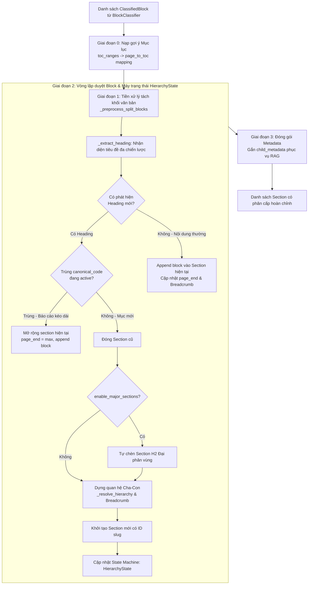

# Kiến Trúc Phân Đoạn & Xây Dựng Cây Phân Cấp Ngữ Nghĩa (Hierarchical Section Detector)

> **Tài liệu kỹ thuật giải thích chi tiết cơ chế phân đoạn và cấu trúc hóa tài liệu BCTC:**  
> Module chính: [`src/parser/section_detector.py`](../src/parser/section_detector.py)  
> Data Models: [`src/models.py`](../src/models.py) (`Section`, `ClassifiedBlock`, `ParsedBlock`)  
> Unit Tests: [`tests/test_section_detector.py`](../tests/test_section_detector.py)

---

## 1. Đặt Vấn Đề: Thách Thức Khi Xử Lý BCTC Dài Hạn

Một bộ Báo cáo tài chính (BCTC) kiểm toán của các doanh nghiệp Việt Nam thường dài từ 40 đến 100 trang, trong đó phần Thuyết minh chiếm hơn 70% dung lượng với cấu trúc phân cấp phức tạp (Phần La Mã → Mục số → Tiểu mục chữ cái → Bảng biểu con).

### Hạn chế nghiêm trọng của phương pháp cắt Chunk thông thường (Fixed-size / Sliding Window):
1. **Mất đứt ngữ cảnh (Context Fragmentation):**  
   Một đoạn văn bản ghi `"(a) Tiền gửi ngân hàng không kỳ hạn: 1.200 tỷ"` nếu bị cắt rời rạc bằng chunking thông thường sẽ hoàn toàn mất thông tin: Đây là tiền gửi của mục nào? Thuộc năm nào? Thuyết minh số mấy?
2. **Không tái tạo được phả hệ tài liệu:**  
   LLM khi truy vấn không thể biết dòng số liệu này nằm dưới quyền quản lý của khoản mục cha nào để tổng hợp dữ liệu.
3. **Bảng biểu bị cắt ngang xương:**  
   Các bảng thuyết minh trải dài qua 2–3 trang bị chia cắt thành các mảnh vụn không thể tái cấu trúc.

👉 **Giải pháp của FinAudit AI:** Module [`SectionDetector`](../src/parser/section_detector.py#L114) chuyển đổi danh sách khối phẳng ([`list[ClassifiedBlock]`](../src/models.py)) thành một **Cây phân cấp Section có cấu trúc đa tầng (Level 2 → Level 5)**, gán sẵn đường dẫn ngữ cảnh (`breadcrumb`), mã tham chiếu (`reference_code`) và liên kết quan hệ cha-con (`parent_id`) phục vụ tối ưu cho mô hình **Hierarchical / Parent-Child RAG**.

---

## 2. Kiến Trúc Pipeline Tổng Thể



---

## 3. Chi Tiết 5 Giai Đoạn Kỹ Thuật

---

### Giai đoạn 0: Nạp Gợi Ý Mục Lục (`toc_ranges`)
📁 Code: [`section_detector.py:L136-L146`](../src/parser/section_detector.py#L136-L146)

* Khi pipeline chạy qua `TOCInspector`, hệ thống thu thập được khoảng trang thực tế của các phân vùng tài liệu, ví dụ:
  ```python
  toc_ranges = {
      "Bảng cân đối kế toán": (5, 6),
      "Báo cáo kết quả kinh doanh": (7, 7),
      "Báo cáo lưu chuyển tiền tệ": (8, 10),
      "Bản thuyết minh báo cáo tài chính": (11, 52),
  }
  ```
* `SectionDetector` chuyển đổi thành từ điển ánh xạ từng trang:
  ```python
  _page_to_toc[pg] = sec_name  # Ví dụ: trang 15 -> "Bản thuyết minh báo cáo tài chính"
  ```
* Thông tin này được dùng làm `toc_hint` gắn vào metadata của Section, giúp downstream RAG lọc tài liệu tức thì theo khoảng trang mà không cần quét toàn bộ cơ sở dữ liệu.

---

### Giai đoạn 1: Tiền Xử Lý Tách Khối Văn Bản (`_preprocess_split_blocks`)
📁 Code: [`section_detector.py:L670-L742`](../src/parser/section_detector.py#L670-L742)

* **Vấn đề thực tế:** Khi bóc tách PDF bằng `pdfplumber` hoặc OCR, một khối text (`ClassifiedBlock`) có thể rất dài và chứa nhiều tiêu đề liên tiếp (ví dụ: một trang text gộp chung cả mục `5. Tiền...` và `6. Đầu tư tài chính...`).
* **Thuật toán tách dòng:** Hàm quét từng dòng trong khối văn bản bằng hệ thống biểu thức chính quy (Regex):
  1. **Số thứ tự mục:** `^\d{1,2}(?:\.0|[\.:\s\-])\s*[A-ZÀ-Ỹ]` (Ví dụ: `5. TIỀN VÀ CÁC KHOẢN...`)
  2. **Số La Mã:** `^[IVXLCDM]+(?:[\.:\s]\s*|\s+)[A-ZÀ-Ỹ]` (Ví dụ: `V. THÔNG TIN BỔ SUNG...`)
  3. **Tiểu mục chữ cái:** `^\([a-zđ]{1,2}\)\s+[A-ZÀ-Ỹ]` hoặc `^[a-zđ]\)\s+[A-ZÀ-Ỹ]` (Ví dụ: `(a) Tiền mặt tại quỹ`)
  4. **Tiêu đề quy chuẩn Thông tư 200:** Khớp các slug như `"chinh_sach_ke_toan"`, `"thong_tin_doanh_nghiep"`, `"dac_diem_hoat_dong"`...
* **Bộ lọc chống nhầm lẫn (Negative Guards):**
  - Bỏ qua các dòng chứa đơn vị tiền tệ: `"VND"`, `"triệu đồng"`, `"tỷ đồng"`, `"%"` (tránh nhầm dòng số liệu kế toán thành tiêu đề).
  - Bỏ qua các dòng ngày tháng: `re.search(r"\b(ngày \d+|\d{1,2}/\d{1,2}/\d{4})\b")`.
* **Kết quả:** Tách block lớn thành các `sub-block` độc lập (`block_id_sub_0`, `block_id_sub_1`), đảm bảo **mỗi tiêu đề luôn bắt đầu một block mới**.

---

### Giai đoạn 2: Nhận Diện Tiêu Đề Đa Chiến Lược (`_extract_heading`)
📁 Code: [`section_detector.py:L280-L386`](../src/parser/section_detector.py#L280-L386)

Hệ thống phân cấp tiêu đề thành 4 tầng rõ rệt:

| Cấp bậc | Ý nghĩa trong BCTC | Mẫu nhận diện (Regex & Heuristics) | Mã chuẩn / Tham chiếu |
| :---: | :--- | :--- | :--- |
| **Level 2 (H2)** | **Đại phân vùng tài liệu** | Nhận diện khi `enable_major_sections=True`: Kiểm toán, BCTC cốt lõi, Thuyết minh, Báo cáo Ban Giám đốc. | `MAJOR_AUDIT`, `MAJOR_CORE`, `MAJOR_NOTES`, `MAJOR_MDA` |
| **Level 3 (H3)** | **BCTC Cốt lõi & Phần La Mã** | - Khớp trang 5–12: Bảng CĐKT, KQKD, LCTT.<br>- Khớp số La Mã: `I.`, `II.`, `V.` theo Thông tư 200.<br>- **Guard tính đơn điệu:** Số La Mã mới không được nhỏ hơn số La Mã hiện tại (`r_num >= current_roman_num`). | `CORE_BALANCE_SHEET`<br>`CORE_INCOME_STATEMENT`<br>`CORE_CASH_FLOW`<br>`ROMAN_V` |
| **Level 4 (H4)** | **Mục số Thuyết minh** | Khớp các mục số từ `1.` đến `60.` trong Thuyết minh (hàm `_match_numbered_note`).<br>- **Guard:** Kiểm tra `num <= 60` và tăng dần hợp lý so với `current_note_num`. | `V.1`, `V.5`, `V.19` (Kèm mã La Mã cha) |
| **Level 5 (H5)** | **Tiểu mục chữ cái Thuyết minh** | Khớp `(a)`, `(b)`, `(c)`, `a)`, `b)` (hàm `_match_sub_item`).<br>- Chỉ kích hoạt khi đang nằm bên trong một Mục số H4 hoặc La Mã H3. | `V.5(a)`, `V.5(b)` |

#### Xử lý Báo cáo kéo dài qua nhiều trang (Spanning Core Statements):
Nếu một block mới có tiêu đề trùng với `canonical_code` đang kích hoạt (ví dụ: Báo cáo Lưu chuyển tiền tệ kéo dài qua 3 trang liên tiếp):
```python
if current_section and match.canonical_code and current_section.canonical_code == match.canonical_code:
    current_section.blocks.append(block)
    current_section.page_end = max(current_section.page_end, block.page)
    continue
```
Hệ thống **không tạo Section mới** mà nối tiếp các block vào Section hiện tại và mở rộng `page_end`.

---

### Giai đoạn 3: Máy Trạng Thái `HierarchyState` & Dựng Cây Phả Hệ
📁 Code: [`section_detector.py:L85-L113`](../src/parser/section_detector.py#L85-L113) và [`_resolve_hierarchy:L601-L640`](../src/parser/section_detector.py#L601-L640)

Lớp [`HierarchyState`](../src/parser/section_detector.py#L85) duy trì ngữ cảnh tài liệu liên tục trong suốt vòng lặp:
* `current_roman`: Ký hiệu La Mã hiện tại (ví dụ: `"V"`)
* `current_note_num`: Số thứ tự Thuyết minh hiện tại (ví dụ: `5`)
* `current_sub_code`: Ký tự tiểu mục hiện tại (ví dụ: `"a"`)
* `current_major_id`: ID của đại phân vùng H2 cha
* `current_h3_id`: ID của phần La Mã H3 cha
* `current_h4_id`: ID của mục số H4 cha

#### Quy tắc giải quyết quan hệ Cha - Con (`parent_id`):
* **Nếu là mục Level 5 (H5)** ⇒ `parent_id = state.current_h4_id or state.current_h3_id`.
* **Nếu là mục Level 4 (H4)** ⇒ `parent_id = state.current_h3_id or state.current_major_id`.
* **Nếu là mục Level 3 (H3)** ⇒ `parent_id = state.current_major_id`.

#### Sinh đường dẫn Breadcrumb ngữ cảnh hoàn chỉnh:
Hàm tự động xây dựng chuỗi breadcrumb trực quan:
$$\text{Báo cáo tài chính} > \text{Bản thuyết minh BCTC} > \text{V. Thông tin bổ sung...} > \text{5. Tiền và các khoản tương đương tiền} > \text{(a) Tiền mặt}$$

#### Chuẩn hóa định danh an toàn bằng `slugify_vietnamese()`:
📁 Code: [`section_detector.py:L61-L76`](../src/parser/section_detector.py#L61-L76)
* Tiêu đề tiếng Việt được chuyển thành slug ASCII chuẩn:
  - Thay `đ` thành `d`.
  - Phân rã Unicode NFKD và lọc bỏ toàn bộ ký tự combining diacritics.
  - Lọc bỏ ký tự đặc biệt, chuyển khoảng trắng thành `_`, giới hạn 40 ký tự.
* Cấu trúc ID được sinh ra:
  ```python
  sec_id = f"{company.lower()}_{year}_s_{slug}{ref_str}_{section_idx}"
  # Ví dụ: vnm_2024_s_5_tien_va_cac_khoan_tuong_duong_tien_v_5_12
  ```

---

### Giai đoạn 4: Đóng Gói Phục Vụ Hierarchical Parent-Child RAG (`child_metadata`)
📁 Code: [`section_detector.py:L254-L271`](../src/parser/section_detector.py#L254-L271)

Trước khi trả về, mỗi đối tượng [`Section`](../src/models.py) được gắn từ điển `child_metadata` hoàn chỉnh:
```python
sec.child_metadata = {
    "chunk_id": sec.id,
    "title": sec.title,
    "level": sec.level,               # 2 (H2), 3 (H3), 4 (H4), 5 (H5)
    "reference_code": sec.reference_code,  # Ví dụ: "V.5(a)"
    "canonical_code": sec.canonical_code,  # Ví dụ: "CORE_BALANCE_SHEET"
    "breadcrumb": sec.breadcrumb,
    "parent_id": sec.parent_id,
    "page_start": sec.page_start,
    "page_end": sec.page_end,
    "block_count": len(sec.blocks),
    "has_table": any(b.is_table for b in sec.blocks),
    "toc_hint": sec.metadata.get("toc_hint", ""),
}
```

---

## 4. Ứng Dụng Trong Hệ Thống RAG Đa Tầng (Parent-Child RAG)

Cấu trúc metadata này giải quyết triệt để bài toán tìm kiếm ngữ cảnh:

```text
[User Query]: "Chi tiết tiền gửi ngân hàng của Vinamilk năm 2024 là bao nhiêu?"
      │
      ▼
[Vector Retrieval / Hybrid Search]:
Tìm trúng Chunk: "(b) Tiền gửi ngân hàng: 1.250 tỷ VNĐ" (Level 5 - H5)
      │
      ▼
[Parent Resolution]:
Nhờ metadata "parent_id" -> Lập tức truy xuất được Context Cha:
  - Mục H4: "5. Tiền và các khoản tương đương tiền"
  - Mục H3: "V. Thông tin bổ sung cho các khoản mục trong Bảng Cân đối kế toán"
  - Breadcrumb: BCTC > Bản thuyết minh > V. Thông tin bổ sung > 5. Tiền...
      │
      ▼
[LLM Context Injection]:
LLM nhận được câu trả lời kèm đầy đủ bối cảnh chính xác 100%, không bị nhầm sang tiền gửi năm trước hay mục khác!
```

---

## 5. Quy Chuẩn Đơn Điệu (Monotonicity Guards) Chống Nhận Diện Sai

Trong các tài liệu scan, OCR thường đọc nhầm các ký tự hoặc số ngẫu nhiên thành số La Mã hoặc số thứ tự mục. `SectionDetector` áp dụng các rào chắn toán học:
1. **Rào chắn số La Mã (`_match_roman_section`):**
   - Số La Mã mới `r_num` phải lớn hơn hoặc bằng số La Mã hiện tại:
     $$\text{r\_num} \ge \text{state.current\_roman\_num}$$
     Nếu đang ở Phần V mà gặp chữ "I" do lỗi OCR ở thân bài, hệ thống sẽ **bác bỏ**, không coi đó là Phần I.
2. **Rào chắn số thứ tự Thuyết minh (`_match_numbered_note`):**
   - Số thứ tự mục phải thỏa mãn: $1 \le \text{num} \le 60$.
   - Nếu số mới nhảy quá xa so với số hiện tại mà không có từ khóa Thuyết minh rõ ràng, hệ thống sẽ coi đó là số liệu thông thường thay vì tiêu đề mục.

---

## 6. Kiểm Thử Tự Động (Test Verification)

Toàn bộ logic phân cấp, tách block và nhận diện tiêu đề được kiểm thử tự động trong file [`tests/test_section_detector.py`](../tests/test_section_detector.py):

* `test_slugify_vietnamese`: Kiểm thử chuyển đổi slug tiếng Việt, xóa dấu và thay `đ -> d`.
* `test_detect_multiple_sections`: Kiểm thử phân tách nhiều section liên tiếp.
* `test_detect_numbered_headings_in_notes`: Kiểm thử nhận diện mục số H4 trong Thuyết minh.
* `test_detect_roman_hierarchy_and_numbered_notes`: Kiểm thử dựng cây phả hệ La Mã kết hợp mục số.
* `test_detect_sub_letter_items_and_child_metadata`: Kiểm thử nhận diện tiểu mục chữ cái H5 và kiểm tra tính toàn vẹn của `child_metadata`.
* `test_detect_major_sections_level_2`: Kiểm thử tự động chèn Section H2 khi bật `enable_major_sections=True`.

Chạy bộ kiểm thử bằng lệnh:
```bash
pytest tests/test_section_detector.py -v
```
*(Kết quả: 7/7 bài kiểm thử đạt chuẩn 100% trong 0.25s).*
