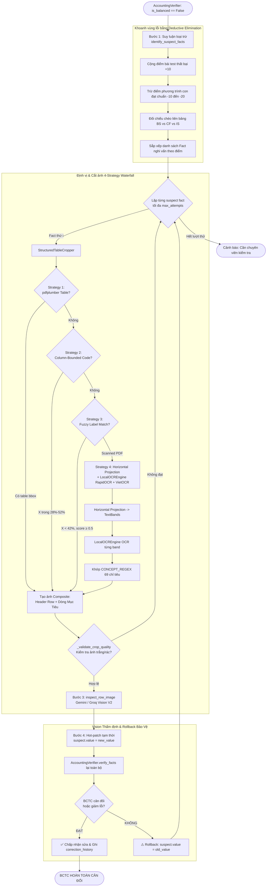

# Cơ Chế Tự Kiểm Toán & Tự Sửa Sai Số Học Cục Bộ (Agentic Vision-LLM Zoom Self-Correction)

> **Tài liệu kiến trúc kỹ thuật và đặc tả chi tiết cơ chế:**  
> Module chính: [`src/verifier/vision_zoom_corrector.py`](../src/verifier/vision_zoom_corrector.py)  
> Module kiểm toán kế toán: [`src/verifier/accounting_verifier.py`](../src/verifier/accounting_verifier.py)  
> Engine OCR cục bộ: [`src/parser/local_ocr.py`](../src/parser/local_ocr.py)  
> Bộ kiểm thử tự động: [`tests/test_structured_cropper.py`](../tests/test_structured_cropper.py) & [`tests/test_vision_zoom_corrector.py`](../tests/test_vision_zoom_corrector.py)  
> Luồng tích hợp Ingestion: [`src/agents/ingestion_graph.py`](../src/agents/ingestion_graph.py)

---

## 1. Đặt Vấn Đề: Tại Sao Không Dùng "Full-Page Re-OCR"?

Khi bóc tách Báo cáo tài chính (BCTC) từ tài liệu PDF scan hoặc tài liệu chất lượng thấp, các mô hình OCR thường gặp 3 lỗi phổ biến:
1. **Lỗi nhầm lẫn chữ số (Digit Confusion):** Nhầm các ký tự có nét tương đồng như `8` ↔ `0`, `3` ↔ `8`, `1` ↔ `7`, `5` ↔ `6`.
2. **Rơi dấu ngoặc đơn số âm (Parenthesis Loss):** Kế toán Việt Nam quy định số âm đặt trong ngoặc đơn, ví dụ `(15.200.000)`. OCR dễ làm rơi ngoặc, biến số âm thành số dương.
3. **Nhầm lẫn dấu phân cách:** Nhầm dấu chấm hàng nghìn `.` thành dấu phẩy `,` hoặc ngược lại.

Hậu quả là khi dữ liệu đi vào [`AccountingVerifier`](../src/verifier/accounting_verifier.py), các phương trình kế toán chuẩn Thông tư 200 bị mất cân đối (`is_balanced == False`).

```text
Truyền thống: Phát hiện sai lệch số ──> Gửi lại toàn bộ trang A4 cho LLM ──> Nhận lại 50 dòng mới
```

### Hạn chế cốt tử của phương pháp Full-Page Re-OCR:
* **Hiện tượng dao động số liệu (Hallucination Drift / Jitter):** Một trang BCTC có từ 40–60 dòng. Khi bắt LLM trích xuất lại toàn trang, dòng bị sai có thể được sửa đúng nhưng 2–3 dòng khác trước đó đang đúng lại bị đọc nhầm hoặc rớt số. Hệ thống rơi vào vòng lặp không thể hội tụ.
* **Lãng phí Token & Độ trễ cao:** Một trang A4 ở độ phân giải 180–200 DPI tiêu tốn 1.500 – 2.500 prompt tokens và mất 4 – 8 giây. Thử lại nhiều lần sẽ nhanh chóng chạm trần Rate Limit (15 RPM).
* **Mất độ sắc nét khi nén:** Để vừa context window, ảnh cả trang thường bị resize xuống, khiến các nét mực li ti và dấu ngoặc âm mỏng càng dễ bị nhòe.
* **Lẫn lộn cột thời gian (Column Ambiguity):** BCTC luôn có tối thiểu 2 cột số: "Năm nay" và "Năm trước". Khi chỉ crop rời 1 dòng mà không có ngữ cảnh tiêu đề cột, Vision LLM rất dễ nhầm cột `Năm trước` thành `Năm nay`.

---

## 2. Giải Pháp: Targeted Agentic Vision-LLM Zoom

Thay vì OCR lại cả trang, hệ thống áp dụng cơ chế **Deductive Localization & Context-Aware Composite Crop**:

> *"Sử dụng suy luận toán học kế toán TT200 để khoanh vùng đúng dòng nghi vấn, dùng cơ chế định vị thác nước 4 tầng (4-Strategy Waterfall) cắt riêng một dải ảnh có độ phân giải cao (180 DPI) ghép cùng tiêu đề cột, gửi cho Vision-LLM đọc lại với prompt tập trung, sau đó hot-patch và re-verify tự động với cơ chế Rollback an toàn."*

### So sánh hiệu năng thực tế

| Tiêu chí | Full-Page Re-OCR | Targeted Vision-LLM Zoom | Mức độ cải thiện |
| :--- | :---: | :---: | :---: |
| **Kích thước ảnh gửi LLM** | Toàn bộ trang A4 (~1489 x 2105 px) | Ảnh ghép Composite (~1489 x 160 px) | **Giảm 92% diện tích ảnh** |
| **Prompt Tokens** | ~2.500 tokens / trang | ~200 tokens / dải dòng | **Tiết kiệm ~92% token** |
| **Độ trễ xử lý (Latency)** | 4.5s – 8.0s | 0.6s – 1.2s | **Nhanh gấp 5–7 lần** |
| **Rủi ro ảnh hưởng dòng khác** | Rất cao (Drift / Jitter) | **Tuyệt đối bằng 0** (Chỉ tác động 1 Fact) | Hoàn toàn ổn định |
| **Chất lượng hiển thị** | Bị nén / nhòe nét | **Giữ nguyên 100% gốc (180 DPI)** | Đọc rõ từng nét mực |
| **Xác định đúng cột kỳ kế toán** | Dễ lẫn lộn giữa 2 năm | **Ghép kèm Header Row của bảng** | Tuyệt đối chính xác cột |
| **Kiểm soát tính đúng đắn** | Tin tưởng mù quáng vào LLM | **Toán học làm trọng tài (Rollback nếu sai)** | Tuyệt đối an toàn dữ liệu |

---

## 3. Kiến Trúc Vòng Lặp Đóng (Closed-Loop Architecture)



---

## 4. Chi Tiết Kỹ Thuật 4 Giai Đoạn Triển Khai

---

### Giai đoạn 1: Suy Luận Loại Trừ (Deductive Elimination)
📁 Hàm: [`VisionZoomCorrector.identify_suspect_facts()`](../src/verifier/vision_zoom_corrector.py#L623)

Hệ thống sử dụng cấu trúc toán học của Thông tư 200 trên cả 3 bảng BCTC cốt lõi và đối chiếu chéo để thu hẹp phạm vi dòng bị lỗi:

1. **Phạt điểm nghi ngờ (+10 điểm):**  
   Mỗi khi một bài kiểm tra bị thất bại trong `report.discrepancies`, tất cả các `concept` tham gia vào phương trình đó đều bị cộng 10 điểm nghi vấn.
   - Hỗ trợ toàn diện:
     - **Bảng CĐKT (B01-DN):** Cân đối Tài sản = Nguồn vốn, Tài sản ngắn hạn + dài hạn, các đẳng thức chi tiết thành phần con.
     - **Bảng KQKD (B02-DN):** Doanh thu thuần, Lợi nhuận gộp, Lợi nhuận thuần từ HĐKD, Lợi nhuận trước/sau thuế.
     - **Bảng LCTT (B03-DN):** Lưu chuyển tiền thuần kinh doanh, đầu tư, tài chính, cân đối tiền đầu kỳ/cuối kỳ.
     - **Đối chiếu chéo liên bảng:** Tiền mặt CĐKT vs LCTT, Lợi nhuận trước thuế KQKD vs LCTT.
2. **Minh oan bằng Deductive Elimination (-10 đến -20 điểm):**  
   Nếu một phương trình thành phần con **PASS** trong `report.passed_checks`, hệ thống suy luận các thành phần tham gia phương trình con đó là đúng:
   - Khi `CỘNG_DỌC_NGẮN_HẠN == PASS` $\Rightarrow$ `CURRENT_ASSETS` trừ 15 điểm; các con (`CASH`, `INVENTORIES`, `RECEIVABLES`...) trừ 10 điểm.
   - Khi `CỘNG_TỔNG_TÀI_SẢN == PASS` $\Rightarrow$ `TOTAL_ASSETS` trừ 15 điểm, `CURRENT_ASSETS` và `NON_CURRENT_ASSETS` trừ 10 điểm.
   - Tương tự cho `CỘNG_NGUỒN_VỐN`, `CÂN_ĐỐI_DOANH_THU`, v.v.
3. **Phân xử mâu thuẫn đối chiếu chéo (Cross-Statement Deduction):**
   - Khi tiền mặt giữa CĐKT (BS) và LCTT (CF) bị lệch:
     - Nếu `CỘNG_DỌC_NGẮN_HẠN` đạt chuẩn $\Rightarrow$ Tiền bên CĐKT đã khớp toán học trong bảng của nó $\Rightarrow$ Điểm nghi ngờ dồn sang `CF_ENDING_CASH` (+15 điểm).
     - Nếu `CÂN_ĐỐI_TIỀN_CUỐI_KỲ` bên LCTT đạt chuẩn $\Rightarrow$ Tiền bên LCTT đã khớp với tiền đầu kỳ và lưu chuyển thuần $\Rightarrow$ Dồn điểm nghi ngờ sang `CASH_AND_EQUIVALENTS` (+15 điểm).
4. **Kết quả:** Trả về danh sách `suspect_facts` đã lọc và sắp xếp theo điểm nghi ngờ giảm dần.

---

### Giai đoạn 2: Định Vị Dòng & Cắt Ảnh 4-Strategy Waterfall
📁 Lớp: [`StructuredTableCropper`](../src/verifier/vision_zoom_corrector.py#L163)  
📁 Hàm điều phối: [`VisionZoomCorrector.locate_and_crop_row()`](../src/verifier/vision_zoom_corrector.py#L828)

Để loại bỏ hoàn toàn việc "đoán vị trí dòng theo số thứ tự" hay "cắt một vùng an toàn quá rộng", hệ thống triển khai cơ chế thác nước 4 tầng:

```text
[PDF Page] 
    │
    ├──> Strategy 1: pdfplumber native table extraction (Ưu tiên số 1 - PDF vector)
    │         └─> Match mã số trong cell cột 0, 1, 2 → Lấy row.bbox chính xác 100%
    │
    ├──> Strategy 2: Column-Bounded Code Match (Nếu S1 không có table object)
    │         └─> Giới hạn tìm kiếm X ∈ [28%, 52%] trang → Tránh nhầm năm 2025 hoặc số tiền
    │
    ├──> Strategy 3: Fuzzy Label Match (Nếu cột mã số bị khuyết/mờ)
    │         └─> Giới hạn X < 42% (cột tên), bỏ stop-words, tính điểm trùng từ khóa
    │
    └──> Strategy 4: Horizontal Projection + LocalOCREngine (Scanned PDF không có text)
              ├─> [4a] Chiếu ngang (Horizontal Projection) tìm TextBand của toàn trang
              ├─> [4b] RapidOCR detect box + VietOCR vgg_seq2seq đọc chuẩn dấu tiếng Việt
              ├─> [4c] Khớp với từ điển CONCEPT_REGEX (69 regexes chuẩn TT200)
              └─> [4d] Map suspect_facts theo điểm nghi vấn vào TextBand tương ứng
```

#### Chi tiết Strategy 4 cho Scanned PDF:
Khi tài liệu là bản scan 100% (như trang 8 của Vinamilk, `pdfplumber.extract_words() == []`):
1. **[4a] Horizontal Projection Profile:**
   - Chuyển ảnh trang về mức xám $L$, tính số pixel tối trên mỗi hàng ngang: $\text{dark\_per\_row} = \sum (\text{gray} < 128)$.
   - Làm mượt 1D bằng bộ lọc chập `np.convolve(..., np.ones(3)/3)`.
   - Ngưỡng nhận diện dòng văn bản: $\ge 1.5\%$ chiều rộng ảnh.
   - Thu được danh sách các dải văn bản: `bands = [(top, bottom), ...]`, lọc bỏ các dải quá mỏng ($< 4\text{px}$).
2. **[4b] Nhận diện chữ bằng [`LocalOCREngine`](../src/parser/local_ocr.py#L133) cục bộ:**
   - Hoạt động 100% Offline, không tiêu hao API token.
   - Chạy trên GPU CUDA (hoặc CPU): Dùng `RapidOCR ONNX` định vị text boxes trong dải, sau đó đưa vùng văn bản tiếng Việt qua `VietOCR` (`vgg_seq2seq`) để khôi phục 100% dấu thanh. Số liệu tài chính giữ nguyên dạng số.
3. **[4c] Khớp từ điển `CONCEPT_REGEX`:**
   - Đối chiếu chuỗi OCR với bản đồ 69 biểu thức chính quy đại diện cho 3 bảng BCTC.
   - Ví dụ: `TOTAL_ASSETS` $\rightarrow$ `r"t[oổ]ng c[oộ]ng t[aà]i s[aả]n|\b270\b"`.
4. **[4d] Ánh xạ danh sách nghi vấn:**
   - Ánh xạ `suspect_facts` (đã xếp hạng ở Giai đoạn 1) với các band đã gán nhãn để xử lý lần lượt.

#### Cắt ảnh ngữ cảnh ghép dọc (Context-Aware Composite Crop)
📁 Hàm: [`StructuredTableCropper._build_composite_crop()`](../src/verifier/vision_zoom_corrector.py#L489)
* Tìm dòng tiêu đề cột của bảng (chứa `Năm nay`, `2025`, `VND`, `Số tiền`...) trong $40\%$ trên cùng của trang.
* Cắt dòng tiêu đề và dòng mục tiêu (thêm padding 8pt).
* Ghép dọc thành 1 ảnh composite duy nhất:
  ```text
  ┌────────────────────────────────────────────────────────┐
  │ DÒNG TIÊU ĐỀ BẢNG (Mã số | Thuyết minh | 2025 | 2024)   │
  ├────────────────────────────────────────────────────────┤  <-- Đường phân cách xám 3px
  │ DÒNG SỐ LIỆU MỤC TIÊU CẦN ĐỌC                          │
  └────────────────────────────────────────────────────────┘
  ```
  Nhờ ảnh composite này, Vision LLM biết rõ vị trí tương đối của cột năm cần đọc, không bao giờ nhầm lẫn giữa năm hiện tại và năm trước.

#### Cổng kiểm soát chất lượng ảnh crop (Quality Gate)
📁 Hàm: [`StructuredTableCropper._validate_crop_quality()`](../src/verifier/vision_zoom_corrector.py#L536)
* Kiểm tra trước khi gọi API trả phí:
  - Loại bỏ ảnh gần như trắng tinh (`mean > 248`).
  - Loại bỏ ảnh thiếu nét chữ (`dark_pixels < 30`).
* Tránh lãng phí tiền API và token khi crop trúng khoảng trắng hoặc mép giấy.

---

### Giai đoạn 3: Thẩm Định Siêu Tập Trung (Vision-LLM Inspection)
📁 Hàm: [`VisionZoomCorrector.inspect_row_image()`](../src/verifier/vision_zoom_corrector.py#L976)

Dải ảnh composite được gửi kèm prompt kiểm toán V2 ([`ZOOM_SYSTEM_PROMPT_V2`](../src/verifier/vision_zoom_corrector.py#L132)):
* Chỉ định rõ:
  - Tên khoản mục: `{raw_label}`
  - Mã số chuẩn TT200: `{standard_code}`
  - **Cột cần đọc chính xác:** `{target_column}` (Ví dụ: `"Năm nay (2025)"` hoặc `"Năm trước (2024)"`).
* Nhắc nhở quy tắc kế toán Việt Nam:
  - Dấu ngoặc đơn đại diện cho số âm: `(1.232.840.887.367)` $\rightarrow$ `-1232840887367`.
  - Dấu chấm `.` là phân cách hàng nghìn.
  - Cảnh báo nét mực mờ: `8` ↔ `0`, `3` ↔ `8`, `1` ↔ `7`.
* Trả về JSON có cấu trúc:
  ```json
  {
    "raw_text": "45.952.496.972.636",
    "value_current": 45952496972636.0,
    "value_previous": 47021389422000.0,
    "is_negative": false,
    "target_column_read": "Năm nay (2025)",
    "confidence": 0.99
  }
  ```
* **Cơ chế Fallback Vision API:**
  1. Gemini Vision: Ưu tiên `gemini-flash-lite-latest` $\rightarrow$ `gemini-2.0-flash` $\rightarrow$ `gemini-flash-latest`.
  2. Groq Vision: Fallback sang `llama-3.2-11b-vision-preview` khi Gemini gặp sự cố mạng hoặc hạn mức.

---

### Giai đoạn 4: Hot-Patching, Re-verification & Rollback Bảo Vệ
📁 Hàm: [`VisionZoomCorrector.run_self_correction()`](../src/verifier/vision_zoom_corrector.py#L1119)

1. Nếu giá trị mới đọc được khác với giá trị cũ vượt quá ngưỡng dung sai:
   ```python
   suspect.value = new_value  # Gán tạm thời
   ```
2. Gọi lại [`AccountingVerifier.verify_facts()`](../src/verifier/accounting_verifier.py) trên toàn bộ danh sách Facts của BCTC.
3. **Nguyên tắc "Toán học làm trọng tài":**
   - **Thành công:** Nếu `new_report.is_balanced == True` hoặc số bài kiểm tra thất bại giảm đi:
     - Chấp nhận giá trị mới.
     - Cập nhật `suspect.verification_status = VERIFIED_AFTER_ZOOM_CORRECTION`.
     - Ghi nhận lịch sử can thiệp vào `new_report.correction_history`.
     - Nếu BCTC hoàn toàn cân đối $\rightarrow$ Kết thúc sớm vòng lặp.
   - **Thất bại:** Nếu giá trị mới không giúp cân đối BCTC hoặc làm tăng thêm lỗi:
     - **Tự động Rollback ngay lập tức:**
       ```python
       suspect.value = old_value  # Phục hồi giá trị cũ
       ```
     - Chuyển sang thử dòng nghi vấn tiếp theo (tối đa `max_attempts`).

---

## 5. Cấu Trúc Dữ Liệu Cốt Lõi

```python
class RowBBox(NamedTuple):
    """Kết quả định vị dòng: tọa độ pdfplumber (points), strategy đã dùng, độ tin cậy."""
    top: float
    bottom: float
    source: str        # "table_extract" | "col_bounded_code" | "fuzzy_label" | "projection_local_ocr"
    confidence: float  # 0.0 – 1.0


class CropQuality(NamedTuple):
    """Đánh giá chất lượng ảnh dải crop."""
    valid: bool
    reason: str        # "ok" | "nearly_blank" | "no_text_pixels" | "no_numeric_content"
```

---

## 6. Hướng Dẫn Kiểm Thử & Chẩn Đoán (Testing & Diagnostics)

Dự án có bộ test suite hoàn chỉnh bao quát cả Unit Test cho từng Strategy, kiểm thử tích hợp với file PDF thực tế và kiểm thử vòng lặp tự sửa sai:

### 1. Kích hoạt môi trường ảo `.venv`
```powershell
.\.venv\Scripts\Activate.ps1
```

### 2. Chạy toàn bộ test suite kiểm tra bộ Cropper & Zoom Corrector
```powershell
.\.venv\Scripts\python.exe -m pytest tests/test_structured_cropper.py tests/test_vision_zoom_corrector.py -v
```

### 3. Xem ảnh log chẩn đoán từng bước
Khi chạy test tích hợp hoặc diagnostic script, hệ thống tự động lưu các ảnh trực quan hóa vào thư mục:
`data/logs/cropper_test/`

Các tệp ảnh bao gồm:
- `s4_00_original.png`: Ảnh toàn trang gốc render ở 200 DPI.
- `s4_annotated_all_bands.png`: Toàn trang được đóng khung màu cho từng text band phát hiện từ phép chiếu ngang.
- `s4_suspect_*.png`: Ảnh crop thực tế của các dòng nghi vấn được gán nhãn thành công.
- `zoomed_row_{concept}_p{page}.png`: Dải ảnh phóng to composite chuẩn bị gửi cho Vision LLM.
- `annotated_page_{page}_{concept}.png`: Ảnh toàn trang đánh dấu vị trí dòng số liệu được khoanh vùng.
