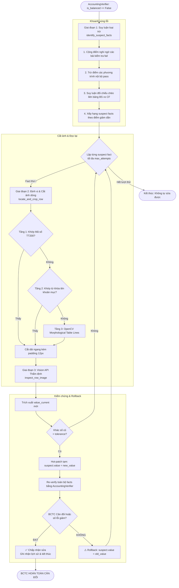

# Cơ Chế Kiểm Tra và Tự Sửa Sai Cục Bộ: Vision-LLM Zoom Corrector

> **Tài liệu kỹ thuật giải thích chi tiết cơ chế hoạt động của module:**  
> [`src/verifier/vision_zoom_corrector.py`](../src/verifier/vision_zoom_corrector.py)

---

## 1. Đặt Vấn Đề & Bối Cảnh (Motivation)

Trong quá trình bóc tách Báo cáo tài chính (BCTC) từ các tài liệu PDF scan hoặc ảnh chụp mờ:
- **Lỗi OCR ký tự số**: Các ký tự có nét tương đồng rất dễ bị đọc nhầm (ví dụ: `8` ↔ `3`, `8` ↔ `0`, `7` ↔ `1`, `5` ↔ `6`).
- **Lỗi bỏ sót dấu âm**: Kế toán Việt Nam quy định số âm đặt trong ngoặc đơn như `(15.200.000)`. Bộ OCR thông thường rất dễ bỏ qua cặp dấu ngoặc này, biến số âm thành số dương.
- **Hậu quả**: Khi đưa vào [`AccountingVerifier`](../src/verifier/accounting_verifier.py), các phương trình kế toán chuẩn Thông tư 200 bị mất cân đối (`is_balanced == False`).

### Tại sao không OCR lại toàn bộ trang?
1. **Lãng phí chi phí & Token**: Gửi toàn bộ trang ảnh lớn (full page) tốn nhiều token và làm tăng đáng kể độ trễ (latency).
2. **Nguy cơ Hallucination cao**: Khi nhìn vào cả một trang dày đặc hàng trăm con số, mô hình Vision-LLM rất dễ đọc lệch dòng, nhầm cột kỳ này với kỳ trước.
3. **Thiếu tính xác thực**: Nếu chỉ OCR lại cả trang mà không có cơ chế đối chiếu toán học, hệ thống có thể tạo ra các lỗi mới thay vì sửa lỗi cũ.

👉 **Giải pháp**: [`VisionZoomCorrector`](../src/verifier/vision_zoom_corrector.py#L48) áp dụng triết lý **Agentic Closed-loop Self-Correction** (Vòng lặp tự sửa sai đóng). Module hoạt động như một **"chiếc kính lúp cục bộ"**: dùng suy luận toán học để khoanh vùng đúng dòng bị nghi vấn, cắt đúng một dải ảnh hẹp với độ phân giải cao, gửi cho Vision-LLM đọc lại và kiểm chứng lại bằng phương trình kế toán.

---

## 2. Kiến Trúc Tổng Thể (Architecture Workflow)



---

## 3. Chi Tiết Từng Giai Đoạn Vận Hành

---

### Giai đoạn 1: Suy luận Loại trừ (Deductive Elimination)
* **Phương thức**: [`identify_suspect_facts()`](../src/verifier/vision_zoom_corrector.py#L59-L256)
* **Mục tiêu**: Xác định chính xác concept/fact nào là "thủ phạm" gây sai lệch số học mà không cần kiểm tra toàn bộ bảng.

#### 1. Ma trận quan hệ Phương trình & Concept (`check_to_concepts`)
Hệ thống lưu trữ cấu trúc liên kết của tất cả các bài kiểm tra kế toán:
- **Bảng Cân đối kế toán (BS)**:
  - `TOTAL_ASSETS == CURRENT + NON_CURRENT`
  - `CURRENT_ASSETS == SUM_CHILDREN` (Tiền, Đầu tư ngắn hạn, Phải thu, Hàng tồn kho, Tài sản ngắn hạn khác)
  - `TOTAL_RESOURCES == LIABILITIES + EQUITY`
- **Báo cáo Kết quả kinh doanh (IS)**:
  - `NET_REVENUE == GROSS_REVENUE - REVENUE_DEDUCTIONS`
  - `GROSS_PROFIT == NET_REVENUE - COGS`
  - `OPERATING_PROFIT == GROSS_PROFIT + FINANCIAL - EXPENSES`
- **Báo cáo Lưu chuyển tiền tệ (CF)**:
  - `CF_NET_CHANGE == OPERATING + INVESTING + FINANCING`
  - `CF_ENDING_CASH == BEGINNING + NET_CHANGE`
- **Đối chiếu chéo (Cross-Statement)**:
  - Tiền cuối kỳ: `CF_ENDING_CASH == CASH_AND_EQUIVALENTS (BS)`
  - Lợi nhuận trước thuế: `CF_PROFIT_BEFORE_TAX == PROFIT_BEFORE_TAX (IS)`

#### 2. Thuật toán chấm điểm nghi ngờ (`suspect_scores`)
1. **Tăng điểm (+10)**: Mỗi khi một bài kiểm tra bị thất bại trong `report.discrepancies`, tất cả các concept tham gia phương trình đó đều bị cộng 10 điểm nghi ngờ.
2. **Áp dụng Deductive Elimination (Trừ 10 đến 15 điểm)**:
   - Nếu phương trình tổng thể bị fail, nhưng một **phương trình con thành phần lại PASS** trong `report.passed_checks`, hệ thống suy luận các thành phần con đó là đúng:
     - Khi `CỘNG_DỌC_NGẮN_HẠN == PASS` ⇒:
       - `CURRENT_ASSETS`: giảm 15 điểm nghi ngờ
       - `CASH_AND_EQUIVALENTS`, `SHORT_TERM_RECEIVABLES`, `INVENTORIES`...: giảm 10 điểm nghi ngờ
3. **Suy luận đối chiếu chéo (Cross-statement Deduction)**:
   - Ví dụ: Bài kiểm tra đối chiếu tiền mặt giữa Cân đối kế toán và Lưu chuyển tiền tệ bị lệch (`LỆCH_ĐỐI_CHIẾU_CHÉO_TIỀN`):
     - Nếu `CỘNG_DỌC_NGẮN_HẠN` bên CĐKT đã PASS ⇒ Tiền mặt bên CĐKT đã khớp với tài sản ngắn hạn ⇒ Số bên CĐKT đúng, lỗi nằm ở Lưu chuyển tiền tệ.
     - Hệ thống tự động: `CASH_AND_EQUIVALENTS` (BS) giảm 20 điểm; `CF_ENDING_CASH` (CF) tăng 15 điểm.
4. **Kết quả**: Sắp xếp các concept có điểm nghi ngờ > 0 theo thứ tự giảm dần và lấy ra danh sách các `suspect_facts`.

---

### Giai đoạn 2: Định vị & Cắt Dải Ảnh Cục Bộ (Sub-image Zoom)
* **Phương thức**: [`locate_and_crop_row()`](../src/verifier/vision_zoom_corrector.py#L258-L410)
* **Mục tiêu**: Tìm chính xác tọa độ dòng chứa số liệu trên trang PDF và cắt đúng một dải ngang có độ phân giải cao.

#### Cơ chế định vị 3 tầng (3-tier Fallback):
1. **Tầng 1 - Tìm theo Mã số chuẩn TT 200 (`clean_code`)**:
   - Dùng `pdfplumber.extract_words()`.
   - Tìm các từ có nội dung khớp với mã số kế toán (ví dụ: `270`, `440`, `110`, `01`, `10`).
   - Nếu tìm thấy, lấy ngay tọa độ `(top, bottom)`.
2. **Tầng 2 - Khớp từ khóa tên khoản mục (`raw_label`)**:
   - Áp dụng khi PDF bị che mất cột mã số.
   - Nhóm các từ có cùng tung độ $Y$ thành từng dòng ngang (`lines_by_y`).
   - Tính điểm khớp từ khóa chính (loại bỏ stop words như: "báo", "cáo", "tài", "chính"...). Dòng nào có số lượng từ khóa trùng khớp nhiều nhất sẽ được chọn.
3. **Tầng 3 - Fallback Thị giác máy tính (OpenCV) cho Scanned PDF hoàn toàn**:
   - **Bối cảnh kích hoạt**: Áp dụng khi trang PDF là ảnh scan 100% (không có text metadata để `pdfplumber.extract_words()` đọc ra chữ), khiến Tầng 1 và Tầng 2 đều không tìm thấy `target_box`.
   - **Mục tiêu**: Tự động nhận diện ranh giới bảng biểu thuần túy dựa vào xử lý ảnh điểm ảnh (Pixel-level Image Processing), không phụ thuộc vào OCR text.
   - **Quy trình xử lý ảnh 5 bước (OpenCV Pipeline)**:
     1. **Chuyển mức xám (Grayscale)**:  
        `gray = cv2.cvtColor(np.array(full_img), cv2.COLOR_RGB2GRAY)`  
        Giảm không gian màu từ 3 kênh RGB về 1 kênh độ sáng để tăng tốc độ tính toán.
     2. **Đảo màu & Nhị phân hóa thích ứng (Adaptive Thresholding with Inversion)**:  
        `binary = cv2.adaptiveThreshold(~gray, 255, cv2.ADAPTIVE_THRESH_MEAN_C, cv2.THRESH_BINARY, 15, -2)`  
        - Phép toán `~gray` (Bitwise NOT) đảo ngược màu: nền trắng thành đen, nét chữ và đường kẻ đen thành sáng trắng.  
        - Dùng ngưỡng động thích ứng vùng cục bộ (`block_size = 15`) giúp loại bỏ hiện tượng ánh sáng không đều, bóng mờ, viền giấy xám do máy scan tạo ra.
     3. **Trích xuất cấu trúc đường kẻ ngang (Morphological Line Filtering)**:  
        - Tạo một phần tử cấu trúc (Structuring Element) dạng thanh ngang:  
          `horizontal_structure = cv2.getStructuringElement(cv2.MORPH_RECT, (cols // 12, 1))`  
          Thanh này có chiều cao 1px và chiều rộng bằng 1/12 chiều rộng trang (khoảng 100px - 150px).  
        - **Xói mòn (Erosion)**: `cv2.erode(binary, horizontal_structure)` → Toàn bộ chữ cái, số liệu, dấu chấm phẩy, hạt nhiễu nhỏ hơn chiều rộng thanh ngang đều bị bào mòn biến mất hoàn toàn.  
        - **Giãn nở (Dilation)**: `cv2.dilate(horizontal, horizontal_structure)` → Khôi phục lại độ dày chuẩn cho các đường kẻ ngang còn sót lại.  
        ⇒ Kết quả thu được là một ảnh nhị phân chỉ còn lại các đường kẻ ngang của khung bảng BCTC.
     4. **Bắt đường viền & Lọc đường kẻ chính (Contour Detection & Filtering)**:  
        `contours, _ = cv2.findContours(horizontal, cv2.RETR_EXTERNAL, cv2.CHAIN_APPROX_SIMPLE)`  
        - Chỉ giữ lại các contour có chiều rộng > 30% độ rộng trang (`width > cols * 0.3`) để loại bỏ các gạch ngang ngắn ngắt quãng.  
        - Sắp xếp tọa độ Y từ trên xuống dưới: `major_lines` là danh sách các đường phân cách ngang của bảng từ đỉnh đến đáy trang.
     5. **Heuristics định vị dòng theo chuẩn BCTC Việt Nam (Financial Layout Matching)**:  
        - **Đối với các chỉ tiêu "TỔNG CỘNG" (Mã `270` - Tổng tài sản, `440` - Tổng nguồn vốn)**:  
          Theo chuẩn kế toán Việt Nam, dòng Tổng cộng luôn nằm ở đáy bảng và được viền bởi dải gạch ngang đôi (chân bảng) phía trên phần chữ ký/footer.  
          * Loại bỏ các đường kẻ footer ở sát đáy trang: `table_lines = [y for y in major_lines if y < img_h * 0.88]`.  
          * Đường kẻ đáy bảng: `bot_line = table_lines[-1]`.  
          * Đường kẻ áp chót: `top_line = table_lines[-2]`.  
          * Thiết lập vùng cắt:  
            ```python
            crop_top = max(0, top_line - 20)
            crop_bot = min(img_h, bot_line + 25)
            ```
        - **Đối với các chỉ tiêu đầu mục lớn (Mã `100`, `200`, `300`, `400`)**:  
          Nằm ở phần đầu bảng ngay sau tiêu đề cột. Thuật toán lấy khoảng giữa đường kẻ thứ nhất và thứ hai:  
          ```python
          crop_top = max(0, major_lines[0] - 15)
          crop_bot = min(img_h, major_lines[1] + 25)
          ```
        - **Trường hợp ngoại lệ (Fallback an toàn)**:  
          Nếu bảng không có đường kẻ rõ ràng, hệ thống tự động cắt khung an toàn giữa trang:  
          `crop_top = int(0.3 * img_h)`, `crop_bot = int(0.6 * img_h)`.

#### Kỹ thuật cắt ảnh bảo vệ:
- Cắt dải ảnh theo chiều ngang của trang PDF (`0.0` đến `page.width`).
- **Thêm padding an toàn**: `pad = 12.0px` ở cả biên trên và biên dưới. Điều này đảm bảo không bao giờ bị cắt mất dấu gạch chân, dấu phẩy, dấu chấm hay cặp dấu ngoặc đơn số âm `(...)`.
- Render ảnh ở độ phân giải cao **180 DPI** và mã hóa thành chuỗi Base64 PNG.
- Có hỗ trợ vẽ Bounding Box màu đỏ và lưu ảnh vào thư mục debug để kiểm tra trực quan.

---

### Giai đoạn 3: Thẩm Định Siêu Tập Trung (Vision-LLM Focus Inspection)
* **Phương thức**: [`inspect_row_image()`](../src/verifier/vision_zoom_corrector.py#L411-L436)
* **Mục tiêu**: Đưa dải ảnh phóng to cho mô hình Vision đọc lại duy nhất 1 dòng số liệu với prompt kiểm toán chuyên dụng.

#### Prompt chuyên dụng ([`ZOOM_SYSTEM_PROMPT`](../src/verifier/vision_zoom_corrector.py#L28-L45)):
Prompt ép mô hình tập trung vào 4 bẫy số liệu kế toán phổ biến nhất:
1. **Dấu ngoặc đơn chỉ số âm**: `(15.200.000)` $\rightarrow$ Giá trị thực: `-15200000`.
2. **Dấu phân cách hàng nghìn**: Phân biệt chuẩn xác giữa dấu chấm (`.`) và dấu phẩy (`,`).
3. **Ký tự dễ nhầm**: Cảnh báo số `8` nhầm `0`, `3` nhầm `8`, `1` nhầm `7`.
4. **Xác định cột**: Cột "Số cuối năm" / "Kỳ này" nằm ngay sau cột Mã số / Thuyết minh.
5. **Output**: Bắt buộc trả về JSON thuần:
   ```json
   {
     "raw_text": "chuỗi văn bản đọc được",
     "value_current": 12345678.0,
     "is_negative": false,
     "confidence": 0.98
   }
   ```

#### Cơ chế Fallback đa tầng (Multi-model Redundancy):
- **Ưu tiên 1 - Google Gemini Flash**:
  - Tự động fallback qua danh sách model:  
    `gemini-flash-lite-latest` $\rightarrow$ `gemini-2.0-flash` $\rightarrow$ `gemini-flash-latest`.
  - Nếu gặp mã lỗi `404`, `503`, hoặc `429` (Rate Limit), hàm tự chuyển sang model kế tiếp mà không làm sập pipeline.
- **Ưu tiên 2 - Groq Vision**:
  - Nếu Gemini không khả dụng hoặc hết hạn mức, tự động fallback sang `llama-3.2-11b-vision-preview` trên Groq.

---

### Giai đoạn 4: Hot-Patching, Re-verify & Rollback Bảo Vệ
* **Phương thức**: [`run_self_correction()`](../src/verifier/vision_zoom_corrector.py#L542-L652)
* **Mục tiêu**: Thử nghiệm giá trị mới, kiểm toán lại và chỉ chấp nhận nếu BCTC cải thiện; rollback ngay nếu làm sai lệch thêm.

Quy trình vòng lặp đóng (Closed-loop):
1. **Kiểm tra độ chênh lệch**: Nếu `abs(new_value - old_value) > tolerance`:
2. **Hot-patching tạm thời**:
   ```python
   suspect.value = new_value
   ```
3. **Kích hoạt Re-verify toàn diện**:
   ```python
   new_report = self.verifier.verify_facts(current_facts, company=company, year=year)
   ```
4. **Đánh giá kết quả**:
   - **Thành công hoàn toàn (`new_report.is_balanced == True`)**:
     - Cập nhật trạng thái: `VerificationStatus.VERIFIED_AFTER_ZOOM_CORRECTION`.
     - Lưu chi tiết vào `new_report.correction_history` (ghi lại con số cũ, con số mới, trang, lý do).
     - Kết thúc vòng lặp và trả về BCTC đã cân đối hoàn hảo.
   - **Cải thiện một phần (`len(failed_checks) < len(current_failed_checks)`)**:
     - Giữ lại giá trị mới và tiếp tục thử dòng nghi vấn tiếp theo.
   - **Không cải thiện hoặc gây sai lệch thêm**:
     - **Rollback an toàn**:
       ```python
       suspect.value = old_value  # Phục hồi giá trị cũ
       ```
     - Chuyển sang thử fact tiếp theo trong danh sách ưu tiên.
5. **Khống chế số lượt thử (`max_attempts = 2`)**:
   - Chỉ thẩm định tối đa 2 dòng nghi vấn hàng đầu để tối ưu hóa thời gian xử lý và không lãng phí API call.

---

## 4. Bảng So Sánh Hiệu Quả: Full-page Re-OCR vs Vision Zoom Corrector

| Tiêu chí | Full-page Re-OCR (Cách truyền thống) | Vision Zoom Corrector (Cách tiếp cận này) |
| :--- | :--- | :--- |
| **Phạm vi xử lý** | Toàn bộ trang A4 (hàng trăm ô dữ liệu) | Đúng 1 dải ngang của dòng nghi vấn (100% điểm ảnh vào 1 dòng) |
| **Số lượng Token API** | Rất lớn (ảnh kích thước lớn + prompt dài) | Rất nhỏ (ảnh cắt hẹp, chỉ đọc duy nhất 1 số) |
| **Nguy cơ Hallucination** | Cao (dễ nhảy dòng, lệch cột giữa các kỳ) | Cực thấp (loại bỏ hoàn toàn bối cảnh gây nhiễu) |
| **Cơ chế kiểm soát** | Phụ thuộc hoàn toàn vào output của LLM | **Toán học kiểm toán làm trọng tài**: LLM đề xuất $\rightarrow$ Verifier quyết định |
| **Khả năng Rollback** | Khó rollback từng dòng riêng lẻ | Tự động rollback ngay lập tức nếu không giúp cân đối BCTC |
| **Thời gian thực thi** | Chậm (5–15 giây cho một trang lớn) | Rất nhanh (< 1.5 giây cho 1 dòng phóng to) |

---

## 5. Tích Hợp Hệ Thống (Integration Points)

Module này được tích hợp liền mạch vào pipeline tại 2 vị trí quan trọng:

1. **Trong LangGraph Agent ([`src/agents/ingestion_graph.py`](../src/agents/ingestion_graph.py))**:
   - Tại các node trích xuất dữ liệu ([`extract_native_pipeline_node`](../src/agents/ingestion_graph.py#L91) và [`extract_core_statements_node`](../src/agents/ingestion_graph.py#L295)), ngay sau khi `FinancialFactExtractor` trích xuất facts ban đầu:
   - Nếu `not audit_report.is_balanced`: Gọi `VisionZoomCorrector().run_self_correction()` để tự động cân bằng BCTC trước khi chuyển tiếp sang node xuất báo cáo.

2. **Trong CLI Script độc lập ([`scripts/parse_bctc.py`](../scripts/parse_bctc.py))**:
   - Được gọi ở cuối chuỗi trích xuất facts để thực hiện thẩm định và sửa lỗi tự động trước khi ghi dữ liệu vào SQLite database.