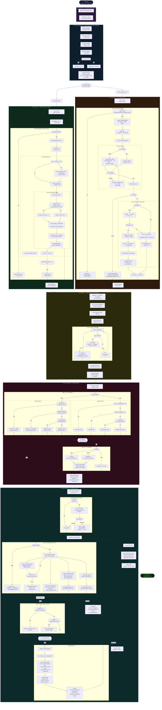

# Parser Pipeline — Chi tiết luồng code

```mermaid
flowchart TD
    START(["📄 pdf_path\ncompany, year, page_range"])

    %% ════════════════════════════════════
    %% ENTRY POINT: PDFParser.parse_pdf()
    %% ════════════════════════════════════
    subgraph ENTRY["pdf_parser.py — PDFParser.parse_pdf()"]
        P0["pdfplumber.open(pdf_path)"]
        P1["Tính start_p / end_p\ntừ page_range (nếu có)"]
    end

    %% ════════════════════════════════════
    %% MODULE 1: PDF TYPE DETECTOR
    %% ════════════════════════════════════
    subgraph MOD1["pdf_type_detector.py — PDFTypeDetector.detect_pages()"]
        D1["Duyệt từng trang\nbằng pdfplumber"]
        D2["page.extract_text()\n→ char_count"]
        D3["len(page.images)\n→ images_count"]
        D4["page.find_tables()\n→ has_tables"]
        D5{{"char_count ≥ 50?"}}
        D6["page_type = 'text'"]
        D7["page_type = 'scanned'"]
        D8["PageClassification\n(page, page_type,\nchar_count, images_count,\nhas_tables)"]
    end

    ROUTE{{"Lọc target_pages\ntheo page_range"}}
    SPLIT_TEXT["text_page_nums"]
    SPLIT_SCAN["scanned_page_nums"]

    %% ════════════════════════════════════
    %% MODULE 2A: TEXT PARSER
    %% ════════════════════════════════════
    subgraph MOD2A["text_parser.py — TextParser.parse_pages()"]
        direction TB
        T0["for p_num in page_numbers"]
        T1["pdf.pages[p_num - 1]\n→ page object"]

        subgraph T_PAGE["parse_page(page, page_number)"]
            TA{{"page.find_tables()?"}}
            TB1["page.extract_text()\n→ 1 text block"]
            TB2["sorted(raw_tables by y0)"]
            TC["Band slicing:\ncurrent_y = 0"]

            subgraph BAND["Cho mỗi table_obj"]
                BD1{{"t_top - current_y > 10?"}}
                BD2["page.crop(band_bbox)\n.extract_text()\n→ band_text block"]
                BD4["table_obj.extract()\n→ extracted_cells"]
                BD5["_process_extracted_table()"]

                subgraph TABLE_PROC["_process_extracted_table()"]
                    TP1["clean_cell_value(c)"]
                    TP2{{"Header 2 tầng?\n('năm'/'kỳ' ở row0\n'kỳ này'/'đầu năm' ở row1)"}}
                    TP3["header_rows_count = 2"]
                    TP4["header_rows_count = 1"]
                    TP5["format_table_to_markdown()\n+ merge_multi_level_headers()"]
                    TP6["compute_numeric_density()\ndetect_currency_unit()"]
                    TP7["ParsedBlock(table)\nsource='pdfplumber'"]
                end

                BD6["current_y = t_bottom"]
            end

            TC2{{"page_height - current_y > 15?"}}
            TC3["crop(tail_bbox)\n→ tail text block"]
        end

        T_OUT["list[ParsedBlock]\nsource='pdfplumber'"]
    end

    %% ════════════════════════════════════
    %% MODULE 2B: OCR PIPELINE
    %% ════════════════════════════════════
    subgraph MOD2B["ocr_pipeline.py — VisionOCRPipeline"]
        direction TB
        OCR0["for p_num in page_numbers"]

        subgraph OCR_PAGE["process_scanned_page()"]
            OC1{{"cache exists?\ndata/cache/ocr/{co}_{yr}/page_{n}.json"}}
            OC2["json.load → list[ParsedBlock]\n(0 API calls)"]
            OC3["page.to_image(150dpi)\n→ PIL Image → PNG → base64"]
            OC5["Rate limit:\nif elapsed < 4.5s: sleep()"]
            OC6["_call_vision_api(img_b64)"]

            subgraph VISION_CALL["_call_vision_api()"]
                VC1{{"ocr_provider?"}}
                VC2["_call_gemini_vision()\nModels: flash-lite → 2.0-flash → ...\nBackoff 3 attempts"]
                VC3["_call_groq_vision()\nllama-3.2-vision"]
                VC4{{"HTTP 429/503?"}}
                VC5["_throttled_models[model]\n= now + 60s\n→ next model"]
                VC6["extracted_text: str"]
            end

            OC7{{"text empty?"}}
            OC8["Graceful Degradation:\nLocalOCREngine(offline)\nb.metadata['is_fallback']=True"]

            subgraph PARSE_MD["_parse_markdown_to_blocks()"]
                PM2{{"line starts '|'?"}}
                PM4["split('|') → raw_rows\nBỏ |---|---|"]
                PM5{{"len(rows) ≥ 2?"}}
                PM6["validate_ocr_table()\n→ {issues, is_valid}"]
                PM7["clean_ocr_number(cell)\n→ normalized số"]
                PM8["format_table_to_markdown()"]
                PM9["ParsedBlock(table)\nsource='ocr', is_scanned=True"]
                PM10["clean_ocr_text_line()\n→ _COMMON_OCR_TEXT_FIXES"]
                PM11["ParsedBlock(text)\nsource='ocr'"]
            end

            OC9["json.dump → cache file"]
        end

        OCR_OUT["list[ParsedBlock]\nsource='ocr'"]
    end

    %% ════════════════════════════════════
    %% MODULE 3: OUTPUT NORMALIZER
    %% ════════════════════════════════════
    subgraph MOD3["normalizer.py — OutputNormalizer.normalize()"]
        N0["combined = text_blocks + ocr_blocks\ngán source label"]
        N1["doc_unit: lấy unit đầu tiên\nfound in combined"]
        N2["sort by (page, bbox.y0, bbox.x0)"]
        N3["Đánh lại block_id:\np{page}_b{counter}"]

        subgraph MERGE["_merge_spanning_tables()"]
            MG1["while i < len(blocks)"]
            MG2{{"curr.is_table?"}}
            MG3{{"nxt.is_table\nnxt.page == curr.page+1\nnum_cols match?"}}
            MG4["curr.content += nxt_data_rows\nmetadata['spans_pages']\ni += 2"]
            MG5["append(curr)\ni += 1"]
        end

        N4["Lan truyền doc_unit\ncho block chưa có unit"]
        NORM_OUT["list[ParsedBlock]\n(sorted, merged, normalized)"]
    end

    %% ════════════════════════════════════
    %% MODULE 4: BLOCK CLASSIFIER
    %% ════════════════════════════════════
    subgraph MOD4["block_classifier.py — BlockClassifier"]
        BC0["for block in blocks: classify_block()"]

        subgraph RULE["Tầng 1: _rule_classify()"]
            R1{{"block.is_table?"}}

            subgraph TABLE_CLS["_classify_table()"]
                RT1{{"density<0.20\n& rows≤3 & cols≤2?"}}
                RT2["NARRATIVE_TABLE\n[vector] conf=0.85"]
                RT3{{"statement_indicator\n& period_columns?"}}
                RT4["FINANCIAL_STATEMENT\n[sql,vector] conf=0.95"]
                RT5{{"note_keywords\nOR high density?"}}
                RT6["NUMERIC_NOTE\n[sql] conf=0.88"]
                RT7["NUMERIC_NOTE\n[sql] conf=0.60 ⚠️"]
            end

            subgraph TEXT_CLS["_classify_text()"]
                TX1{{"POLICY_KEYWORDS ≥ 1?"}}
                TX2["POLICY [vector]"]
                TX3{{"MDA_KEYWORDS ≥ 1?"}}
                TX4["MDA [vector]"]
                TX5{{"numbers≥3\n& financial_units≥1?"}}
                TX6["MIXED [sql,vector]"]
                TX7["NARRATIVE [vector]"]
            end
        end

        BC1{{"confidence\n≥ threshold 0.75?"}}

        subgraph LLM["Tầng 2: _llm_classify()"]
            LF1{{"provider?"}}
            LF2["ChatGroq\nwith_structured_output"]
            LF3["ChatOpenAI\nwith_structured_output"]
            LF4["LLM=None → giữ rule"]
            LF5["prompt: content[:800]\n→ {block_type, target,\nconfidence, reasoning}"]
        end

        CLS_OUT["list[ClassifiedBlock]\n(block_type, target, confidence,\nclassification_method, reasoning)"]
    end

    %% ════════════════════════════════════
    %% MODULE 5: SECTION DETECTOR
    %% ════════════════════════════════════
    subgraph MOD5["section_detector.py — SectionDetector"]
        direction TB
        SD0["state = HierarchyState()\nsection_idx = 1"]

        subgraph PREPROC["_preprocess_split_blocks()"]
            PP2{{"is_table or\nlines ≤ 1?"}}
            PP3["Giữ nguyên"]
            PP4["Tìm split_indices:\nregex heading (số/La Mã/chữ)"]
            PP5{{"split_indices?"}}
            PP6["Tách → nhiều ClassifiedBlock\nblock_id='..._sub_i'"]
        end

        SD1["for block in refined_blocks"]

        subgraph HEADING["_extract_heading(block, state)"]
            H0{{"block.is_table?"}}
            H1["header_row → _PRIMARY_STATEMENTS\n→ HeadingMatch(level=3)"]
            H2["strip_boilerplate_lines()\nfirst_clean = lines[0]"]
            H3["_match_roman_section()\nRegex ^(VIII|VII|...|I)\nFallback slugify"]
            H4{{"roman_num ≥\ncurrent_roman_num?"}}
            H5["HeadingMatch(level=3)\nroman_code, canonical_code"]
            H6["BCTC cốt lõi (page≤12):\nbảng cân đối / kết quả /\nlưu chuyển\n→ HeadingMatch(level=3)"]
            H7["_match_numbered_note()\nRegex ^\\d{1,2}[.:\\s]+\nOCR replacements\nMonotonicity guard"]
            H8["HeadingMatch(level=4)\nitem_code='Roman.num'"]
            H9["_match_sub_item()\nRegex ^\\([a-z]\\)[\\s.:]+"]
            H10["HeadingMatch(level=5)\nitem_code='Roman.num(a)'"]
        end

        SD2{{"HeadingMatch?"}}

        subgraph MAJOR["_maybe_create_major_section()"]
            MJ1{{"CORE & not\nemitted_core_major?"}}
            MJ2["Section H2: PHẦN 1 BCTC CỐT LÕI"]
            MJ3{{"notes & not\nemitted_notes_major?"}}
            MJ4["Section H2: PHẦN 2 THUYẾT MINH"]
        end

        SD3{{"curr_section exists\n& same canonical_code?"}}
        SD4["Append block\npage_end = max(...)"]

        subgraph NEW_SEC["Tạo Section mới"]
            NS1["slugify_vietnamese(title)"]
            NS2["sec_id='{co}_{yr}_s_{slug}_{idx}'"]
            NS3["_resolve_hierarchy()\nLevel 3→parent=major_id\nLevel 4→parent=roman_sec_id\nLevel 5→parent=note_sec_id\n→ breadcrumb"]
            NS4["_update_state()\ncurrent_roman, current_note_num,\ncurrent_sub_code..."]
            NS5["Section(\n  id, title, level, parent_id,\n  breadcrumb, canonical_code,\n  reference_code, blocks=[block]\n)"]
        end

        SD5["No heading:\nif no current_section:\n  Tạo Section 'THÔNG TIN CHUNG'\nelse: append block"]

        SD6["Lưu section cuối"]

        SD7["child_metadata cho tất cả:\n{chunk_id, breadcrumb,\nhas_table, block_count,\npage_start, page_end}"]

        SEC_OUT["list[Section]\n(cây H2→H3→H4→H5)"]
    end

    FINAL_OUT(["✅ list[Section] + ParsedDocument"])

    %% ════════ CONNECTIONS ════════
    START --> P0 --> P1
    P1 --> D1
    D1 --> D2 --> D3 --> D4 --> D5
    D5 -->|"Yes"| D6 --> D8
    D5 -->|"No"| D7 --> D8
    D8 --> ROUTE --> SPLIT_TEXT & SPLIT_SCAN

    SPLIT_TEXT --> T0 --> T1 --> TA
    TA -->|"No"| TB1
    TA -->|"Yes"| TB2 --> TC --> BD1
    BD1 -->|"Yes"| BD2
    BD1 -->|"No"| BD4
    BD2 --> BD4
    BD4 --> TP1 --> TP2
    TP2 -->|"Yes"| TP3 --> TP5
    TP2 -->|"No"| TP4 --> TP5
    TP5 --> TP6 --> TP7 --> BD6 --> TC2
    TC2 -->|"Yes"| TC3
    TB1 & TC3 & TP7 --> T_OUT

    SPLIT_SCAN --> OCR0 --> OC1
    OC1 -->|"Hit"| OC2 --> OCR_OUT
    OC1 -->|"Miss"| OC3 --> OC5 --> OC6
    OC6 --> VC1
    VC1 -->|"gemini"| VC2
    VC1 -->|"groq"| VC3
    VC2 & VC3 --> VC4
    VC4 -->|"429/503"| VC5 --> VC2
    VC4 -->|"200"| VC6 --> OC7
    OC7 -->|"Empty"| OC8 --> OCR_OUT
    OC7 -->|"OK"| PM2
    PM2 -->|"Table"| PM4 --> PM5
    PM5 -->|"Yes"| PM6 --> PM7 --> PM8 --> PM9 --> OC9
    PM5 -->|"No"| PM10 --> PM11 --> OC9
    PM2 -->|"Text"| PM10
    OC9 --> OCR_OUT

    T_OUT & OCR_OUT --> N0 --> N1 --> N2 --> N3
    N3 --> MG1 --> MG2
    MG2 -->|"Yes"| MG3
    MG2 -->|"No"| MG5
    MG3 -->|"Yes"| MG4 --> MG1
    MG3 -->|"No"| MG5 --> MG1
    MG4 & MG5 --> N4 --> NORM_OUT

    NORM_OUT --> BC0 --> R1
    R1 -->|"Table"| RT1
    RT1 -->|"Yes"| RT2
    RT1 -->|"No"| RT3
    RT3 -->|"Yes"| RT4
    RT3 -->|"No"| RT5
    RT5 -->|"Yes"| RT6
    RT5 -->|"No"| RT7
    R1 -->|"Text"| TX1
    TX1 -->|"Yes"| TX2
    TX1 -->|"No"| TX3
    TX3 -->|"Yes"| TX4
    TX3 -->|"No"| TX5
    TX5 -->|"Yes"| TX6
    TX5 -->|"No"| TX7
    RT2 & RT4 & RT6 & RT7 & TX2 & TX4 & TX6 & TX7 --> BC1
    BC1 -->|"Pass"| CLS_OUT
    BC1 -->|"Fail"| LF1
    LF1 -->|"groq"| LF2
    LF1 -->|"openai"| LF3
    LF1 -->|"none"| LF4
    LF2 & LF3 --> LF5 --> CLS_OUT
    LF4 --> CLS_OUT

    CLS_OUT --> SD0
    SD0 --> PP2
    PP2 -->|"Yes"| PP3
    PP2 -->|"No"| PP4 --> PP5
    PP5 -->|"No splits"| PP3
    PP5 -->|"Has splits"| PP6
    PP3 & PP6 --> SD1 --> H0
    H0 -->|"Table"| H1 --> SD2
    H0 -->|"Text"| H2 --> H3 --> H4
    H4 -->|"Pass"| H5 --> SD2
    H4 -->|"Fail"| H2
    H2 --> H6 --> SD2
    H2 --> H7 --> H8 --> SD2
    H2 --> H9 --> H10 --> SD2

    SD2 -->|"Match"| MJ1
    MJ1 -->|"Yes"| MJ2 --> SD3
    MJ1 -->|"No"| MJ3
    MJ3 -->|"Yes"| MJ4 --> SD3
    MJ3 -->|"No"| SD3
    SD3 -->|"Same code"| SD4 --> SD1
    SD3 -->|"New"| NS1 --> NS2 --> NS3 --> NS4 --> NS5 --> SD1
    SD2 -->|"No match"| SD5 --> SD1
    SD1 --> SD6 --> SD7 --> SEC_OUT --> FINAL_OUT

    %% STYLES
    style START fill:#1a1a2e,color:#e0e0e0,stroke:#4a90d9,stroke-width:2px
    style FINAL_OUT fill:#0d2b0d,color:#90e090,stroke:#4aaa4a,stroke-width:2px
    style ENTRY fill:#2a1a3e,color:#d0c0f0,stroke:#9060d0,stroke-width:1px
    style MOD1 fill:#0d1f2d,color:#a0c8e0,stroke:#3a70a0,stroke-width:1px
    style MOD2A fill:#0d2a1a,color:#90d8a8,stroke:#3a9060,stroke-width:1px
    style MOD2B fill:#2d1a0d,color:#e0b880,stroke:#a07030,stroke-width:1px
    style MOD3 fill:#2a2a0d,color:#e0e080,stroke:#a0a030,stroke-width:1px
    style MOD4 fill:#2d0d1a,color:#e090b0,stroke:#a03060,stroke-width:1px
    style MOD5 fill:#0d2a2a,color:#80d8d8,stroke:#30a0a0,stroke-width:1px
```
